## High-Level Plan

This section maps the major phases of the **Kessia** capstone project from team formation to final delivery. The project runs over **~12 weeks**, from the start of team formation (April 27, 2026) to the final presentation (July 17, 2026).

---

### Visual Timeline

---

### Team

| Name | Role |
|------|------|
| Soumia Taoui | Product Owner & Project Sponsor |
| Victor Monnot | Frontend Lead / co-developer |
| Yasi Philippe Hübner | Backend Lead / co-developer |

**Soumia Taoui** commissioned the project and owns the product vision. She participates in coordination and validation at each stage: reviewing deliverables, approving scope decisions, and providing domain feedback. She does not contribute code but is a required sign-off on all major milestones.

---

### Project Stages Overview

| Stage | Phase | Period |
|-------|-------|--------|
| 1 | Idea Development | Apr 27 – May 3 (Week 1) |
| 2 | Project Planning | Apr 27 – May 3 (Week 1) |
| 3 | Technical Documentation | May 4 – May 25 (Weeks 2–4) |
| 4 | MVP Development | May 26 – Jul 5 (Weeks 5–10) |
| 5 | Project Closure | Jul 6 – Jul 17 (Weeks 11–12) |

### Timeline & Key Milestones

| Week | Dates | Stage | Key Milestones / Deliverables |
|------|-------|-------|-------------------------------|
| 1 | Apr 27 – May 3 | Idea Dev. + Project Planning | Team formation, problem statement, MVP scope locked, project charter (Trello, roles, communication plan) |
| 2 | May 4 – May 10 | Technical Documentation | User stories, user flows, wireframes (low-fi), tech stack justification |
| 3 | May 11 – May 17 | Technical Documentation | ERD / database schema, URL routing plan, system architecture diagram |
| 4 | May 18 – May 25 | Technical Documentation | API/REST endpoints contract (frontend ↔ backend), risks & ethics doc finalized, **Tech Doc submission (May 25)** |
| 5 | May 26 – May 31 | MVP Development | Project bootstrap (Django + PostgreSQL backend, React + Tailwind frontend), auth scaffolding, dual-role user model |
| 6 | Jun 1 – Jun 7 | MVP Development | Sign-up flows (medical pro / writer), profile basics, admin tooling (e.g. SQLAdmin) |
| 7 | Jun 8 – Jun 14 | MVP Development | Service listings CRUD (writers create/edit/delete), public listings page |
| 8 | Jun 15 – Jun 21 | MVP Development | Service detail page, order placement form, notification logic |
| 9 | Jun 22 – Jun 28 | MVP Development | End-to-end integration, basic styling pass, seed data |
| 10 | Jun 29 – Jul 5 | MVP Development | Bug fixing, manual QA, deployment to Railway/Render, README polish |
| 11 | Jul 6 – Jul 12 | Project Closure | Demo script, slide deck, final testing, dry-run presentations |
| 12 | Jul 13 – Jul 17 | Project Closure | **Final presentation (Jul 17)**, repo cleanup, retrospective |

### School Deliverable Deadlines

- **Apr 27 – May 3:** Portfolio Project — Team Formation, Brainstorming & MVP + Project Planning
- **May 4 – May 25:** Portfolio Project — Technical Documentation
- **Jul 17:** Final project deadline & presentation

### Task Split

**Stage 3 — Technical Documentation (May 4 – May 25)**

| Owner | Responsibilities |
|-------|------------------|
| Victor | User stories, user flows, wireframes, ethics & risks section (ICMJE / COPE) |
| Yasi | Tech stack rationale, system architecture diagram, ERD / database schema, deployment plan |
| Both | Final review pass, README integration, MVP scope validation |
| Soumia | Reviews and validates all deliverables, approves scope before Tech Doc submission (May 25) |

**Stage 4 — MVP Development (May 26 – Jul 5)**

| Owner | Responsibilities |
|-------|------------------|
| Victor (frontend lead) | React app setup (Vite + Tailwind), routing, sign-up/login UI, listings browse page, service detail page, order placement form, API integration |
| Yasi (backend lead) | Django project setup, PostgreSQL schema, dual-role auth & user models, listings & orders models, admin tooling, deployment (Railway/Render) |
| Both | Integration points (order notification flow), seed data, manual QA, bug-fixing sprints |
| Soumia | Sprint-end feature validation, acceptance criteria review, raises change requests if scope needs adjustment |

**Stage 5 — Project Closure (Jul 6 – Jul 17)**

| Owner | Responsibilities |
|-------|------------------|
| Victor | Demo script, slide deck (product sections), presentation rehearsal |
| Yasi | Final deployment, demo data, slide deck (technical sections) |
| Both | Final dry-runs, retrospective, repo & documentation cleanup |
| Soumia | Final product sign-off, validates demo scenario, attends dry-run and final presentation |

### Working Cadence

- **Weekly sync:** Monday — Victor, Yasi + Soumia review last week, plan current week, update Trello board
- **Mid-week check-in:** Thursday — Victor & Yasi unblock issues, adjust scope if needed
- **Milestone reviews:** End of each stage — Soumia validates deliverables before the team moves forward
- **Tooling:** Trello (tasks), GitHub (code + PR reviews), shared Google Drive (docs)
- **Branching:** feature branches → PR review by the other teammate before merge to `main`
