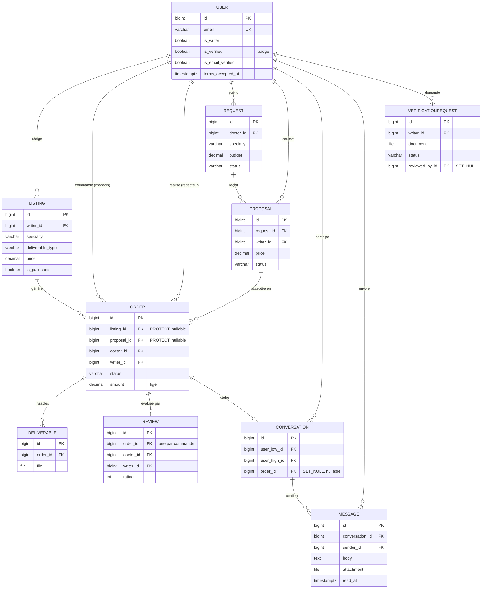

# Kessia

Kessia est une **marketplace de rédaction médicale et scientifique** : elle met en
relation des **médecins et institutions de santé** avec des **rédacteurs
scientifiques freelance**.

Rédiger un article, un protocole ou une synthèse rigoureuse demande un temps et une
expertise dont les praticiens ne disposent pas toujours. Kessia leur permet de
**déléguer cette rédaction** à des professionnels et de **suivre chaque commande**,
en échangeant en temps réel avec le rédacteur — sur une plateforme unique, en français.

> **Démo en ligne** (environnement de test) : <https://kessia-j1mk.onrender.com>
> · **API / Swagger** : <https://kessia-j1mk.onrender.com/api/docs/>

Projet capstone Holberton 2026 — Victor Monnot, Yasi Philippe Hübner, Soumia Taoui.

---

## Fonctionnalités

Marketplace **bi-face** : un compte est médecin par défaut et peut activer un profil
**rédacteur**.

- **Double publication** — annonces (offres des rédacteurs) et demandes (besoins des
  médecins), avec propositions.
- **Catalogue** filtrable et profils publics de rédacteurs.
- **Commandes** à cycle de vie complet et **livrables** déposés / téléchargés de
  façon sécurisée.
- **Messagerie en temps réel** (WebSocket).
- **Avis** réservés aux commandes terminées.
- **Badge « rédacteur vérifié »** validé par un administrateur.
- **Gestion du compte** : réinitialisation de mot de passe, vérification de l'e-mail,
  connexion Google, suppression de compte.
- **Confiance & conformité** : CGU + cookies (RGPD), mode lecture seule avant
  vérification, limitation de débit, limites sur les fichiers.
- **Interface 100 % française**, responsive.

### Parcours type

Le médecin commande une rédaction (ou accepte une proposition) ; le rédacteur la prend
en charge, échange en temps réel, puis dépose le livrable ; le médecin le télécharge,
confirme la fin de la commande et laisse un avis.

---

## Stack technique

| Couche | Technologies |
|--------|--------------|
| **Backend** | Django 5 + DRF · JWT (cookie httpOnly + CSRF) · Django Channels (ASGI / Daphne) |
| **Base de données** | PostgreSQL (Neon en déploiement) |
| **Frontend** | React 18 + Vite + Tailwind · TanStack Query · Zustand · Axios |
| **Services** | E-mails via l'API Brevo · connexion Google (OAuth) |
| **Outillage** | Docker · déploiement Render · pytest / Vitest · ruff / ESLint |

Apps Django : `users`, `listings`, `orders`, `requests_board`, `reviews`,
`messaging`, `verification`, `common`.

---

## Architecture

Architecture **trois tiers** — SPA React, API Django REST + Channels (ASGI),
PostgreSQL. En déploiement, un **service web Render unique** sert le SPA compilé
(WhiteNoise) et l'API sur la même origine.


- **REST** — Axios attache le token d'accès ; sur un `401`, il rafraîchit via le
  cookie httpOnly et rejoue la requête.
- **Temps réel** — WebSocket authentifié par token ; les messages REST sont diffusés
  au fil de conversation.
- **Services** — e-mails via l'API HTTPS de Brevo (Render bloque le SMTP) ; connexion
  Google vérifiée côté serveur.

---

## Modèle de données

**10 modèles, 7 apps.** La **commande (`Order`) est le pivot** : elle naît d'un achat
d'annonce **ou** d'une proposition acceptée, avec le montant et le rédacteur **figés à
la création**.



---

## Démarrage

Prérequis : **Docker** + **Docker Compose**.

```bash
git clone <repo>
cd Kessia
cp .env.example .env
docker compose up --build
docker compose exec backend python manage.py seed_demo   # données de démo (idempotent)
```

Comptes de démo : `doctor@kessia.demo` et `writer@kessia.demo` (mot de passe
`demo1234`).
Adresses locales : Frontend <http://localhost:5173/> · Swagger
<http://localhost:8000/api/docs/> · Admin <http://localhost:8000/admin/>.

---

## Tests

```bash
docker compose exec backend pytest -q            # 161 tests
docker compose exec frontend npm test -- --run   # 22 tests
```

Les tests backend tournent sur le **même PostgreSQL** qu'en exécution ; les services
tiers sont *mockés*.

---

## Documentation

Documentation complète du projet (sprints, QA, revue technique) dans
[`docs/`](docs/), indexée par [`docs/Deliverables.md`](docs/Deliverables.md).

---

## Équipe

| Membre | Rôle |
|--------|------|
| Soumia Taoui | Product Owner |
| Yasi Philippe Hübner | Backend Lead · SCM · Déploiement |
| Victor Monnot | Frontend Lead · QA |
