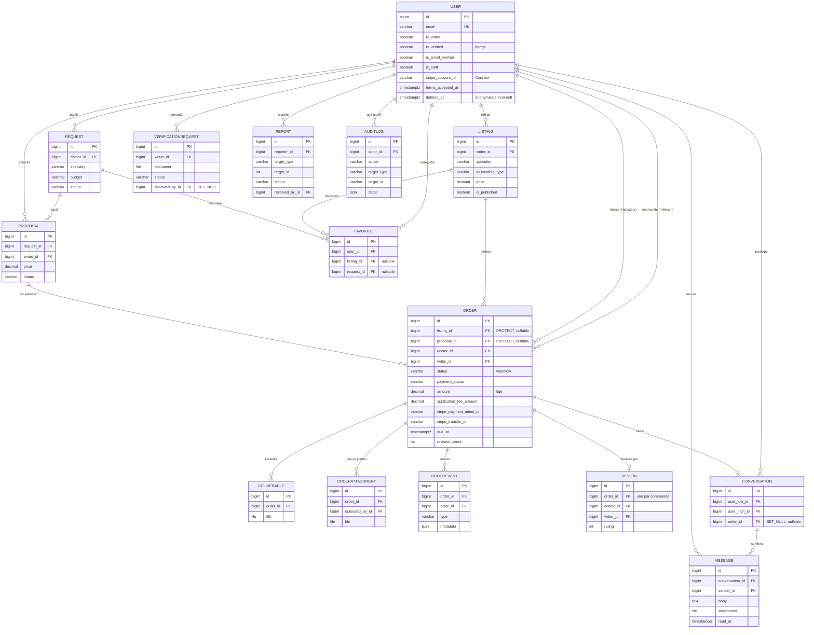

# Kessia

Kessia est une **marketplace de rédaction médicale et scientifique** : elle met en
relation des **médecins et des institutions de santé** avec des **rédacteurs
scientifiques freelance**.

Rédiger un article, un protocole de recherche ou une synthèse rigoureuse demande un
temps et une expertise dont les praticiens ne disposent pas toujours. Kessia leur
permet de **déléguer cette rédaction** à des professionnels, de **payer en toute
sécurité** (fonds séquestrés jusqu'à la livraison), de **suivre l'avancement** de
chaque commande et d'**échanger en temps réel** avec le rédacteur — le tout sur une
plateforme unique, en français.

> **Démo en ligne** (environnement de test) : <https://kessia-j1mk.onrender.com>
> · **API / Swagger** : <https://kessia-j1mk.onrender.com/api/docs/>
> · **Dépôt** : <https://github.com/victormonnot/Kessia>

Projet capstone Holberton 2026 — Victor Monnot, Yasi Philippe Hübner, Soumia Taoui.

---

## Fonctionnalités

Kessia est une marketplace **bi-face** : un même compte est médecin (acheteur) par
défaut et peut activer un profil **rédacteur**.

- **Double publication** — les rédacteurs publient des **annonces** (offres de
  service) ; les médecins publient des **demandes**, auxquelles les rédacteurs
  répondent par des **propositions** (acceptation atomique qui crée la commande).
- **Catalogue** filtrable, paginé et cherchable (spécialité médicale, type de
  document, prix) et **profils publics** de rédacteurs enrichis (expériences,
  publications, portfolio, langues, délai de réponse).
- **Commandes** avec un cycle de vie complet (machine à états : *en attente →
  acceptée → en cours → livrée → terminée*), **échéance** et **demandes de
  révision**, **pièces jointes** (brief / documents sources) et **livrables**
  déposés puis téléchargés de façon sécurisée (accès réservé aux parties prenantes),
  le tout tracé dans un **journal d'activité** par commande.
- **Paiement en ligne (Stripe Connect)** — paiement par carte à l'acceptation,
  **fonds séquestrés** par la plateforme, **versement au rédacteur** (montant − 15 %
  de commission) à la finalisation, **remboursement automatique** en cas de refus ou
  d'annulation. Les rédacteurs s'intègrent via l'**onboarding Stripe Express**.
- **Messagerie en temps réel** entre le médecin et le rédacteur (WebSocket), avec
  **pièces jointes** et suivi des messages non lus.
- **Avis** notés, réservés aux commandes **terminées**, agrégés sur les profils et
  les annonces.
- **Favoris** — annonces et demandes enregistrées.
- **Badge « rédacteur vérifié »** après soumission de justificatifs et validation
  par un administrateur.
- **Back office administrateur** — statistiques, **modération** de contenu et de
  comptes (suppression **réversible**), **remboursement** de commandes, gestion des
  **signalements** et **journal d'audit** de toutes les actions staff.
- **Cycle de vie du compte** : inscription, réinitialisation de mot de passe,
  **vérification de l'e-mail**, changement d'e-mail / de mot de passe, suppression de
  compte, et **connexion Google**.
- **Confiance & conformité** : acceptation des CGU et bannière cookies (RGPD),
  suppression de compte par **anonymisation** (RGPD), mode **lecture seule** tant que
  l'e-mail n'est pas vérifié, **limitation de débit** (anti-abus), révocation des
  autres sessions au changement de mot de passe et limites de taille / de type sur
  les fichiers.
- **Interface 100 % française**, responsive sur mobile.

### Parcours type

Un médecin s'inscrit, parcourt le catalogue (ou publie une demande) et commande une
rédaction à un rédacteur — ou accepte l'une de ses propositions. Il **paie par carte**
(les fonds sont séquestrés) ; le rédacteur prend la commande en charge, les deux
échangent en temps réel, puis le rédacteur dépose le livrable. Le médecin le
télécharge, confirme la fin de la commande — le **versement** part alors vers le
rédacteur — et laisse un avis. De son côté, un rédacteur fait vérifier ses
qualifications pour afficher un badge de confiance et s'intègre à Stripe pour être payé.

---

## Stack technique

| Couche | Technologies |
|--------|--------------|
| **Backend** | Django 5.2 LTS + Django REST Framework ; authentification **JWT** (token d'accès en mémoire + *refresh* en cookie httpOnly + CSRF) ; **Django Channels** (ASGI / Daphne) pour le temps réel |
| **Base de données** | **PostgreSQL** (Neon en déploiement) |
| **Temps réel** | Django Channels — couche *in-memory* en local, **Redis** en production |
| **Paiements** | **Stripe Connect** (*separate charges & transfers*) — séquestre, versements, remboursements, webhooks idempotents |
| **Frontend** | React 18 + Vite + Tailwind CSS ; TanStack Query, Zustand ; Axios (*refresh* silencieux sur 401) ; react-hook-form + zod |
| **Services externes** | E-mails transactionnels via **Brevo** (django-anymail) ; **connexion Google** (OAuth / OIDC) |
| **Fichiers** | **WhiteNoise** (statiques) ; médias servis par le service unique ou **S3** (django-storages) si un bucket est configuré |
| **Outillage** | Docker & Docker Compose (local) ; déploiement **Render** (service web unique) ; tests **pytest** / **Vitest** ; lint **ruff** / **ESLint** |

Apps Django (11) : `users`, `listings`, `requests_board`, `orders`, `payments`,
`messaging`, `reviews`, `verification`, `favorites`, `admin_panel`, `common`.

---

## Architecture

L'application suit une architecture **trois tiers** : un SPA React, une API Django
REST + Channels (ASGI) et PostgreSQL. En déploiement, un **service web Render unique**
sert à la fois le SPA compilé (via WhiteNoise) et l'API **sur la même origine**, ce
qui simplifie la gestion du CORS et des cookies.


- **Flux REST** — Axios attache le token d'accès en mémoire ; DRF authentifie
  (SimpleJWT), vérifie les permissions, lit/écrit via l'ORM puis sérialise le JSON.
  Sur un `401`, Axios appelle silencieusement `/auth/refresh/` (cookie httpOnly) et
  rejoue la requête. L'API est versionnée sous `/api/v1/`.
- **Temps réel** — le navigateur ouvre un WebSocket portant le token d'accès ; un
  *consumer* Channels l'authentifie et rejoint le fil de conversation ; les messages
  envoyés en REST sont diffusés au groupe (couche Redis en production).
- **Paiements** — le montant de la commande est prélevé par carte à l'acceptation et
  **retenu** par la plateforme ; à la finalisation, un *transfer* (montant − 15 %)
  crédite le compte **Stripe Connect** du rédacteur ; un refus ou une annulation
  déclenche un remboursement. Les **webhooks Stripe font foi** et sont **idempotents**
  (chaque événement traité est journalisé pour qu'un rejeu ne déplace jamais deux fois
  les fonds).
- **Services** — les e-mails transactionnels partent via l'API HTTPS de Brevo
  (Render bloque le SMTP sortant) ; la connexion Google vérifie l'*ID token* signé
  côté serveur.
- **Back office** — une API réservée au staff pilote la modération, les
  remboursements et les signalements ; chaque action est écrite dans un **journal
  d'audit** en ajout seul.

---

## Modèle de données

**19 modèles répartis sur 11 apps.** La **commande (`Order`) est le pivot** : elle
naît d'un achat d'annonce **ou** d'une proposition acceptée ; le montant et le
rédacteur y sont **figés à la création**, afin que l'engagement ne dépende jamais
d'une annonce ou d'une proposition modifiée par la suite. Deux machines à états
distinctes coexistent sur la commande et se conditionnent l'une l'autre : le
**workflow** (`pending → accepted → in_progress → delivered → completed`) et le
**paiement** (`unpaid → processing → held → released / refunded`).

Le diagramme ci-dessous montre les entités principales. S'y ajoutent les sous-modèles
de **profil rédacteur** (`WriterExperience`, `WriterPublication`,
`WriterPortfolioItem`) et le registre d'événements Stripe (`StripeEvent`, ledger
d'idempotence des webhooks).



---

## Démarrage

Prérequis : **Docker** + **Docker Compose**.

```bash
git clone https://github.com/victormonnot/Kessia
cd Kessia
cp .env.example .env
docker compose up --build
```

La configuration tient dans un seul fichier `.env` (voir `.env.example`) :
identifiants PostgreSQL, `DJANGO_SECRET_KEY`, réglages CORS / cookies, `REDIS_URL`,
clés **Stripe** (`STRIPE_SECRET_KEY`, `STRIPE_PUBLISHABLE_KEY`,
`STRIPE_WEBHOOK_SECRET`), `KESSIA_PLATFORM_FEE_PERCENT` (15 par défaut) et l'**ID
client Google** (`GOOGLE_OAUTH_CLIENT_ID` / `VITE_GOOGLE_CLIENT_ID` ; laisser vide
désactive simplement le bouton Google).

Puis charger les données de démo (commande **idempotente** — relançable sans
doublon) pour ne pas démarrer sur une interface vide :

```bash
docker compose exec backend python manage.py seed_demo
```

Elle crée trois comptes principaux, tous avec le mot de passe `demo1234` :

- **Rédacteur** — `writer@kessia.demo`
- **Médecin** — `doctor@kessia.demo`
- **Admin** (back office, staff/superuser) — `admin@kessia.demo` *(compte de démo, à
  retirer avant une vraie mise en production)*

… ainsi qu'un jeu complet de rédacteurs et de médecins supplémentaires, d'annonces,
de demandes, de propositions et de commandes à différents stades.

Adresses locales :

- Frontend : <http://localhost:5173/>
- API / Swagger : <http://localhost:8000/api/docs/>
- Admin Django : <http://localhost:8000/admin/>

### Paiements (Stripe, mode test)

Le flux de paiement exige des **clés de test Stripe** (renseignées dans `.env`).
Parcours : le médecin commande → le rédacteur accepte → le médecin **paie** (carte de
test `4242 4242 4242 4242`, date future, CVC quelconque) → les fonds sont **séquestrés**
→ à la finalisation, le **versement** (montant − 15 % de commission) part vers le
compte **Stripe Connect** du rédacteur ; une annulation après paiement rembourse
automatiquement. Les **webhooks font foi** ; en local, faites-les suivre avec la CLI
Stripe :

```bash
stripe listen --forward-to localhost:8000/api/v1/payments/webhook/
```

---

## Tests

```bash
docker compose exec backend pytest -q            # > 230 tests
docker compose exec frontend npm test -- --run   # ~30 tests
docker compose exec backend ruff check apps/ config/
docker compose exec frontend npm run lint
```

Les tests backend s'exécutent sur le **même PostgreSQL** qu'à l'exécution (le
verrouillage de lignes pour l'acceptation atomique des propositions est donc
réellement testé) ; les SDK **Stripe** et **Google** sont *mockés* et
l'**idempotence des webhooks** est vérifiée en rejouant les événements — de quoi
rester rapide, hors-ligne et déterministe. Le frontend (pages, formulaires, hooks)
est testé avec Vitest et Testing Library.

---

## Déploiement

Un **service web Render unique** sert le SPA compilé (WhiteNoise) et l'API sur la même
origine, adossé à **PostgreSQL Neon**. Le temps réel s'appuie sur **Redis** (couche
Channels) et les e-mails transactionnels sur **Brevo** (Render bloque le SMTP
sortant). Les médias sont servis par le service unique (éphémère, suffisant pour la
démo) ou par un **stockage S3** durable si `AWS_STORAGE_BUCKET_NAME` est défini
(django-storages).

---

## Documentation

La documentation complète de la phase de développement — planification de
sprints, revues, rétrospectives, suivi qualité, tests et préparation de la revue
technique — est regroupée dans un document unique :
[`docs/MVP_Development_and_Execution_(Stage_4).md`](<docs/MVP_Development_and_Execution_(Stage_4).md>).
Les documents des étapes précédentes (Stage 1 à 3) et les comptes-rendus de réunion
restent dans le dossier [`docs/`](docs/).

---

## Équipe

| Membre | Rôle |
|--------|------|
| Soumia Taoui | Product Owner |
| Yasi Philippe Hübner | Backend Lead · SCM · Déploiement |
| Victor Monnot | Frontend Lead · QA |
