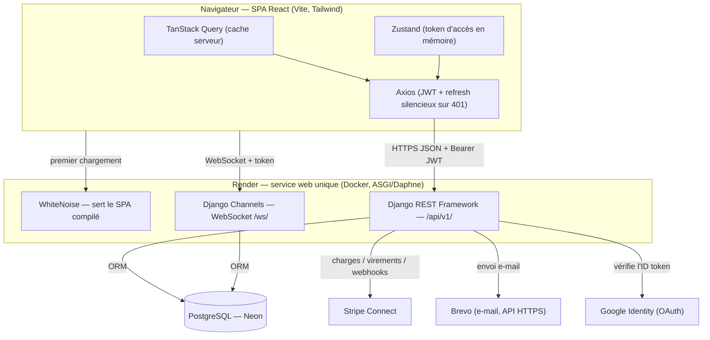
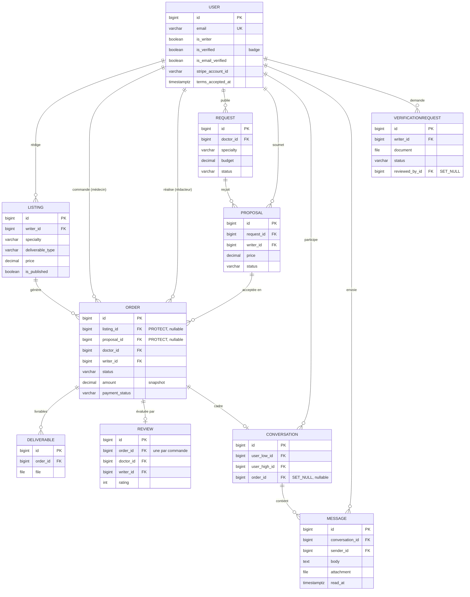

# Kessia

Marketplace de rédaction médicale qui met en relation médecins / institutions et rédacteurs scientifiques freelance. Projet capstone Holberton 2026 (Victor Monnot, Yasi Philippe Hübner, Soumia Taoui).

**Démo en production :** <https://kessia-j1mk.onrender.com> · **API Swagger :** <https://kessia-j1mk.onrender.com/api/docs/>

Documentation projet : voir [`High-LevelPlan.md`](docs/High-LevelPlan.md) (planning, équipe, jalons), le dossier [`Meetings/`](docs/Meetings/) et la section [Documentation du projet](#documentation-du-projet) ci-dessous.

## Getting Started

Prérequis : Docker + Docker Compose.

```bash
git clone <repo>
cd Kessia
cp .env.example .env
docker compose up --build
```

Puis charger les données de démo pour ne pas avoir une UI vide :

```bash
docker compose exec backend python manage.py seed_demo
```

La commande est idempotente — vous pouvez la relancer sans créer de doublons. Elle crée notamment un compte rédacteur (`writer@kessia.demo`) et un compte médecin (`doctor@kessia.demo`), tous deux avec le mot de passe `demo1234`, plus un jeu d'annonces, de demandes, de commandes et de propositions.

Adresses locales :

- Frontend : <http://localhost:5173/>
- API Swagger : <http://localhost:8000/api/docs/>
- Admin Django : <http://localhost:8000/admin/>

### Paiements (Stripe, mode test)

Le flux de paiement exige des **clés de test Stripe** dans `.env` (`STRIPE_SECRET_KEY`, `STRIPE_PUBLISHABLE_KEY`). Parcours : le médecin commande → le rédacteur accepte → le médecin paie (carte de test `4242 4242 4242 4242`) → les fonds sont séquestrés → à la finalisation, le versement (montant − 15 % de commission) part vers le compte Stripe Connect du rédacteur ; une annulation après paiement rembourse automatiquement.

### Messagerie temps réel

Le backend tourne en **ASGI (Daphne)** ; la messagerie utilise Django Channels (couche in-memory en dev, Redis en prod).

## Tests

```bash
docker compose exec backend pytest -q          # 161 tests
docker compose exec frontend npm test -- --run # 22 tests
docker compose exec frontend npm run lint
```

Stratégie de test détaillée et résultats : [`QA/QA_and_Testing.md`](docs/QA/QA_and_Testing.md).

## Architecture

- **Backend** : Django 5 + DRF, JWT (refresh token en cookie httpOnly + CSRF), PostgreSQL (Neon en prod), Stripe Connect (paiements en séquestre), Django Channels + Daphne (WebSockets), e-mails transactionnels via l'API Brevo, connexion Google (OAuth). Apps : `users`, `listings`, `orders`, `requests_board`, `payments`, `reviews`, `messaging`, `verification`, `common`.
- **Frontend** : React 18 + Vite + Tailwind, TanStack Query, Zustand, Axios (refresh silencieux sur 401). UI 100 % française.
- **Déploiement** : service web unique sur Render (Django sert le SPA compilé via WhiteNoise + l'API sur la même origine).

### Schéma d'architecture




### Schéma de base de données (ERD)

10 modèles répartis sur 8 apps. La commande (`Order`) est le pivot : elle naît d'un achat d'annonce **ou** d'une proposition acceptée ; le montant et le rédacteur y sont figés à la création.



> Diagrammes détaillés et version « as-built » commentée : [`Technical_Manual_Review.md`](docs/Technical_Manual_Review.md) (§3 architecture, §4 base de données). Spécification d'origine : [`Technical_Documentation_(Stage_3).md`](<docs/Technical_Documentation_(Stage_3).md>).

## Documentation du projet

| Document | Contenu |
|----------|---------|
| [`Technical_Documentation_(Stage_3).md`](<docs/Technical_Documentation_(Stage_3).md>) | User stories, architecture, ERD, séquences, API, justifications techniques |
| [`Technical_Manual_Review.md`](docs/Technical_Manual_Review.md) | Préparation de la revue technique : architecture & ERD à jour, points de défense |
| [`Sprints/Sprint_Planning.md`](docs/Sprints/Sprint_Planning.md) | Plan de sprints, MoSCoW, responsabilités, dépendances |
| [`Sprints/Sprint_Reviews.md`](docs/Sprints/Sprint_Reviews.md) | Revues de sprint (démos au Product Owner) |
| [`Sprints/Retrospectives.md`](docs/Sprints/Retrospectives.md) | Rétrospectives |
| [`Sprints/Progress_Tracking.md`](docs/Sprints/Progress_Tracking.md) | Suivi de progression, vélocité, métriques |
| [`QA/QA_and_Testing.md`](docs/QA/QA_and_Testing.md) | Stratégie de test, preuves et résultats, QA d'intégration |
| [`QA/Bug_Tracking.md`](docs/QA/Bug_Tracking.md) | Suivi des bugs |
| [`Deliverables.md`](docs/Deliverables.md) | Index de tous les livrables avec liens |
| [`High-LevelPlan.md`](docs/High-LevelPlan.md) · [`Meetings/`](docs/Meetings/) | Planning programme & comptes-rendus de réunion |

## Équipe

| Membre | Rôle |
|--------|------|
| Soumia Taoui | Product Owner & Sponsor |
| Yasi Philippe Hübner | Backend Lead · SCM · Déploiement |
| Victor Monnot | Frontend Lead · QA |
