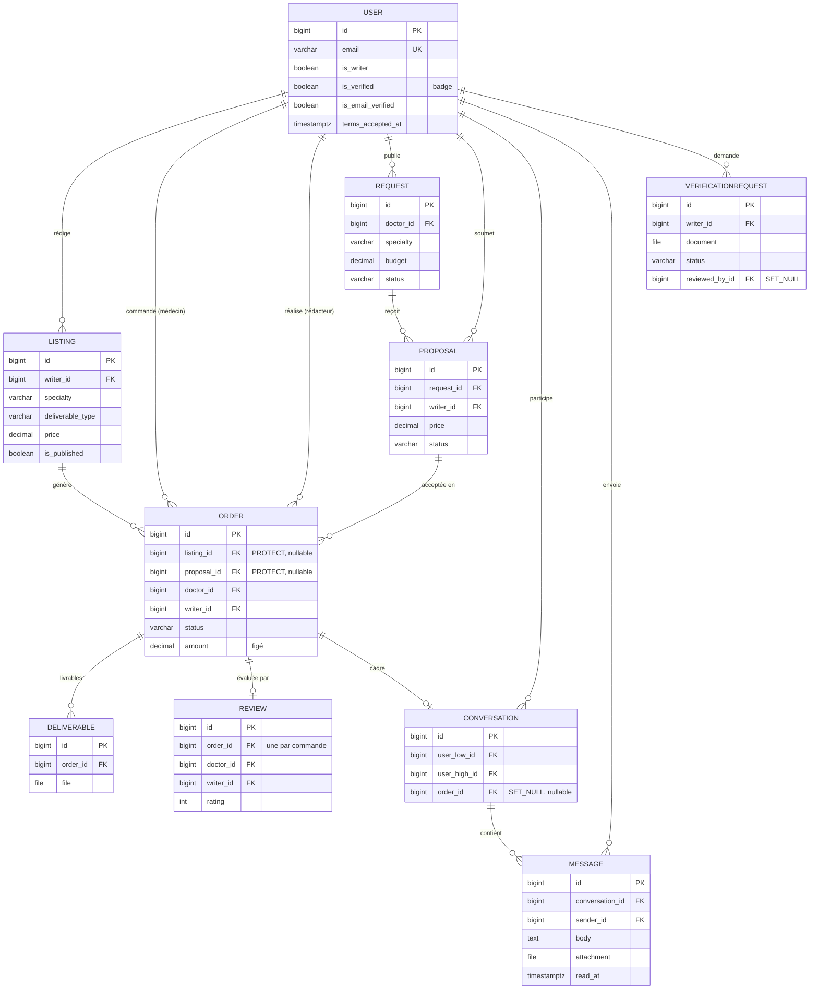

# Kessia

Kessia est une **marketplace de rédaction médicale et scientifique** : elle met en
relation des **médecins et des institutions de santé** avec des **rédacteurs
scientifiques freelance**.

Rédiger un article, un protocole de recherche ou une synthèse rigoureuse demande un
temps et une expertise dont les praticiens ne disposent pas toujours. Kessia leur
permet de **déléguer cette rédaction** à des professionnels, de **suivre
l'avancement** de chaque commande et d'**échanger en temps réel** avec le rédacteur —
le tout sur une plateforme unique, en français.

> **Démo en ligne** (environnement de test) : <https://kessia-j1mk.onrender.com>
> · **API / Swagger** : <https://kessia-j1mk.onrender.com/api/docs/>

Projet capstone Holberton 2026 — Victor Monnot, Yasi Philippe Hübner, Soumia Taoui.

---

## Fonctionnalités

Kessia est une marketplace **bi-face** : un même compte est médecin (acheteur) par
défaut et peut activer un profil **rédacteur**.

- **Double publication** — les rédacteurs publient des **annonces** (offres de
  service) ; les médecins publient des **demandes**, auxquelles les rédacteurs
  répondent par des **propositions**.
- **Catalogue** filtrable et paginé (spécialité médicale, type de document, prix) et
  **profils publics** de rédacteurs.
- **Commandes** avec un cycle de vie complet (machine à états : *en attente →
  acceptée → en cours → livrée → terminée*) et **livrables** déposés puis téléchargés
  de façon sécurisée (accès réservé aux parties prenantes).
- **Messagerie en temps réel** entre le médecin et le rédacteur (WebSocket).
- **Avis** notés, réservés aux commandes **terminées**, agrégés sur les profils et
  les annonces.
- **Badge « rédacteur vérifié »** après soumission de justificatifs et validation
  par un administrateur.
- **Cycle de vie du compte** : inscription, réinitialisation de mot de passe,
  **vérification de l'e-mail**, changement d'e-mail / de mot de passe, suppression de
  compte, et **connexion Google**.
- **Confiance & conformité** : acceptation des CGU et bannière cookies (RGPD), mode
  **lecture seule** tant que l'e-mail n'est pas vérifié, **limitation de débit**
  (anti-abus) et limites de taille / de type sur les fichiers.
- **Interface 100 % française**, responsive sur mobile.

### Parcours type

Un médecin s'inscrit, parcourt le catalogue (ou publie une demande) et commande une
rédaction à un rédacteur — ou accepte l'une de ses propositions. Le rédacteur prend
la commande en charge, les deux échangent en temps réel, puis le rédacteur dépose le
livrable. Le médecin le télécharge, confirme la fin de la commande et laisse un avis.
De son côté, un rédacteur peut faire vérifier ses qualifications pour afficher un
badge de confiance.

---

## Stack technique

| Couche | Technologies |
|--------|--------------|
| **Backend** | Django 5 + Django REST Framework ; authentification **JWT** (token d'accès en mémoire + *refresh* en cookie httpOnly + CSRF) ; **Django Channels** (ASGI / Daphne) pour le temps réel |
| **Base de données** | **PostgreSQL** (Neon en déploiement) |
| **Frontend** | React 18 + Vite + Tailwind CSS ; TanStack Query, Zustand ; Axios (*refresh* silencieux sur 401) ; react-hook-form + zod |
| **Services externes** | E-mails transactionnels via l'**API Brevo** ; **connexion Google** (OAuth / OIDC) |
| **Outillage** | Docker & Docker Compose (local) ; déploiement **Render** (service web unique) ; tests **pytest** / **Vitest** ; lint **ruff** / **ESLint** |

Apps Django : `users`, `listings`, `orders`, `requests_board`, `reviews`,
`messaging`, `verification`, `common`.

---

## Architecture

L'application suit une architecture **trois tiers** : un SPA React, une API Django
REST + Channels (ASGI) et PostgreSQL. En déploiement, un **service web Render unique**
sert à la fois le SPA compilé (via WhiteNoise) et l'API **sur la même origine**, ce
qui simplifie la gestion du CORS et des cookies.


- **Flux REST** — Axios attache le token d'accès en mémoire ; DRF authentifie
  (SimpleJWT), vérifie les permissions, lit/écrit via l'ORM puis sérialise le JSON.
  Sur un `401`, Axios appelle silencieusement `/auth/refresh/` (cookie httpOnly) et
  rejoue la requête.
- **Temps réel** — le navigateur ouvre un WebSocket portant le token d'accès ; un
  *consumer* Channels l'authentifie et rejoint le fil de conversation ; les messages
  envoyés en REST sont diffusés au groupe.
- **Services** — les e-mails transactionnels partent via l'API HTTPS de Brevo
  (Render bloque le SMTP sortant) ; la connexion Google vérifie l'*ID token* signé
  côté serveur.

---

## Modèle de données

**10 modèles répartis sur 7 apps.** La **commande (`Order`) est le pivot** : elle naît
d'un achat d'annonce **ou** d'une proposition acceptée ; le montant et le rédacteur y
sont **figés à la création**, afin que l'engagement ne dépende jamais d'une annonce ou
d'une proposition modifiée par la suite.



---

## Démarrage

Prérequis : **Docker** + **Docker Compose**.

```bash
git clone <repo>
cd Kessia
cp .env.example .env
docker compose up --build
```

Puis charger les données de démo (commande **idempotente** — relançable sans
doublon) pour ne pas démarrer sur une interface vide :

```bash
docker compose exec backend python manage.py seed_demo
```

Elle crée un compte rédacteur (`writer@kessia.demo`) et un compte médecin
(`doctor@kessia.demo`), tous deux avec le mot de passe `demo1234`, ainsi qu'un jeu
d'annonces, de demandes, de commandes et de propositions.

Adresses locales :

- Frontend : <http://localhost:5173/>
- API / Swagger : <http://localhost:8000/api/docs/>
- Admin Django : <http://localhost:8000/admin/>

---

## Tests

```bash
docker compose exec backend pytest -q            # 161 tests
docker compose exec frontend npm test -- --run   # 22 tests
docker compose exec backend ruff check apps/ config/
docker compose exec frontend npm run lint
```

Les tests backend s'exécutent sur le **même PostgreSQL** qu'à l'exécution (le
verrouillage de lignes pour l'acceptation atomique des propositions est donc
réellement testé) ; les services tiers sont *mockés* pour rester rapides, hors-ligne
et déterministes.

---

## Documentation

La documentation complète du projet — planification de sprints, revues,
rétrospectives, suivi qualité et préparation de la revue technique — est regroupée
dans le dossier [`docs/`](docs/) et indexée par
[`docs/Deliverables.md`](docs/Deliverables.md).

---

## Équipe

| Membre | Rôle |
|--------|------|
| Soumia Taoui | Product Owner |
| Yasi Philippe Hübner | Backend Lead · SCM · Déploiement |
| Victor Monnot | Frontend Lead · QA |
