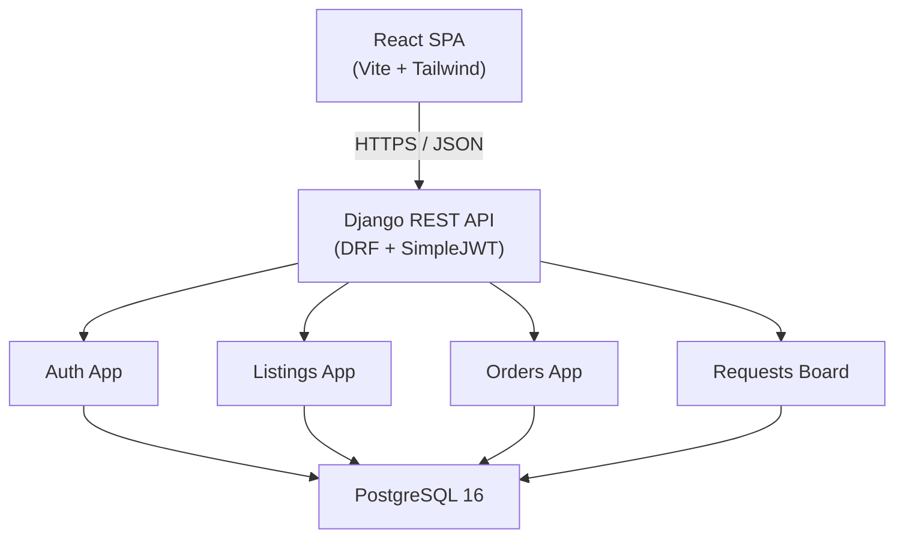
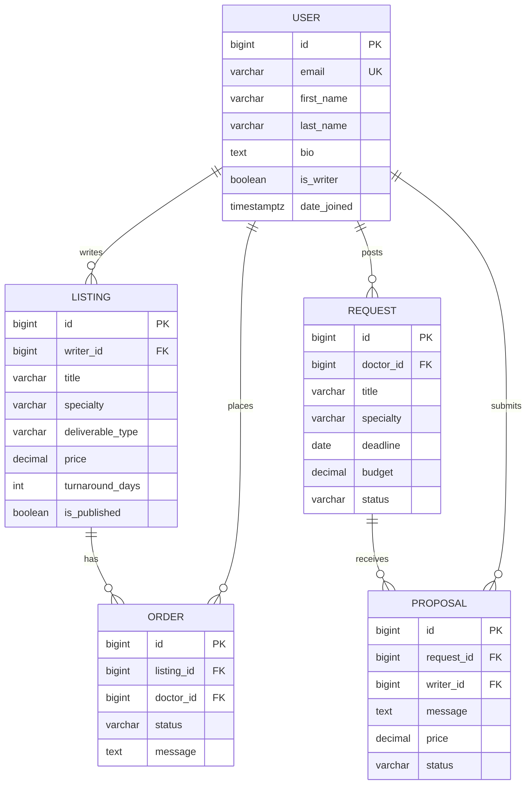
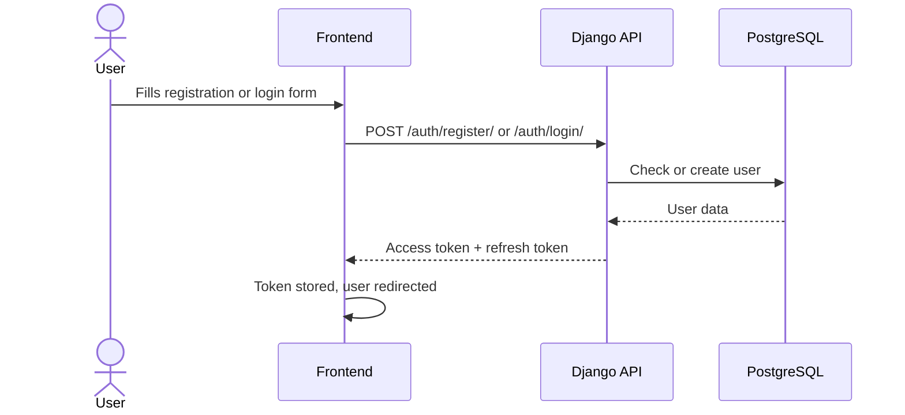
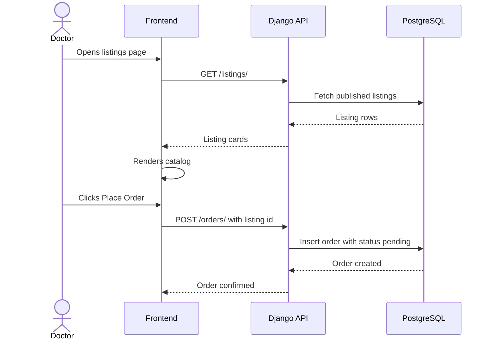
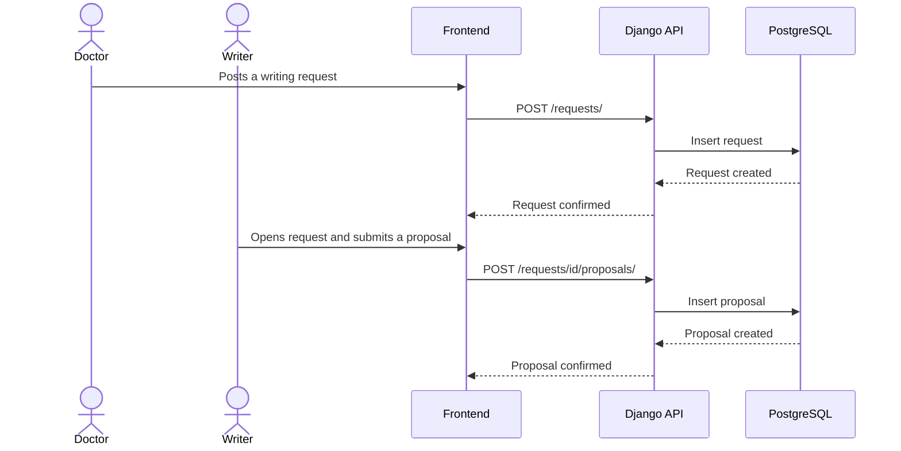

# Kessia — Technical Documentation (Stage 3)

---

## Table of Contents

1. [System Architecture](#1-system-architecture)
2. [Components, Classes & Database Design](#2-components-classes--database-design)
3. [Sequence Diagrams](#3-sequence-diagrams)
4. [API & Methods](#4-api--methods)
5. [SCM & QA Strategy](#5-scm--qa-strategy)
6. [Technical Justifications](#6-technical-justifications)

---

## 1. System Architecture

Kessia is a three-tier application: a React SPA on the client, a Django REST API in the middle, and a PostgreSQL database for persistence. The full stack runs locally via Docker Compose.

**Data flow in short:**
Client sends a request with a JWT token → Django validates it and runs the business logic → the ORM reads or writes PostgreSQL → the result is serialised to JSON and returned to the frontend.

---

## 2. Components, Classes & Database Design

### 2.1 Frontend Pages

| Page | Route | Access | Purpose |
|------|-------|--------|---------|
| Landing | `/` | Public | Homepage with sign-up CTA |
| Register / Login | `/register` `/login` | Public | Account creation and login |
| Listings | `/listings` | Public | Browse writer service catalog |
| Listing Detail | `/listings/:id` | Public | Full offer + Place Order button |
| Listing Form | `/listings/new` `/listings/:id/edit` | Writer | Create or edit a listing |
| Requests | `/requests` | Public | Board of open writing requests |
| Request Detail | `/requests/:id` | Public | Full request + proposal form |
| Request Form | `/requests/new` | Authenticated | Post a writing request |
| Dashboard Writer | `/dashboard/writer` | Writer | My listings and incoming orders |
| Dashboard Doctor | `/dashboard/doctor` | Authenticated | My placed orders and statuses |

**Key UI components:** `ListingCard`, `ListingFilters`, `PlaceOrderModal`, `RequestCard`, `ProposalForm`, `OrderRow`, `StatusBadge`, `ProtectedRoute`, `WriterRoute`.

**State management:** Zustand stores auth tokens, TanStack React Query handles server data caching, Axios manages HTTP requests with automatic JWT refresh on 401.

---

### 2.2 Backend Apps (Django)

| App | Models | Responsibility |
|-----|--------|----------------|
| `users` | `User` | Auth, JWT, writer activation |
| `listings` | `Listing` | Service offers: CRUD + public catalog |
| `orders` | `Order` | Order placement and status transitions |
| `requests_board` | `Request`, `Proposal` | Reverse marketplace: doctors post, writers respond |

**User model fields:** `email` (unique login), `first_name`, `last_name`, `bio`, `is_writer` (role flag), `is_staff`, `date_joined`.

**Listing model fields:** `writer` (FK), `title`, `description`, `specialty`, `deliverable_type`, `price`, `turnaround_days`, `is_published`.

**Order model fields:** `listing` (FK, protected), `doctor` (FK), `status` (`pending → accepted | declined → delivered`), `message`.

**Request model fields:** `doctor` (FK), `title`, `description`, `specialty`, `deadline`, `budget`, `status` (`open | closed`).

**Proposal model fields:** `request` (FK), `writer` (FK), `message`, `price`, `status` (`pending → accepted | rejected`). One proposal per writer per request enforced at DB level.

---

### 2.3 Database Schema

**Order status:** `pending → accepted | declined` then `accepted → delivered`

**Proposal status:** `pending → accepted | rejected`

---

## 3. Sequence Diagrams

### 3.1 Registration & Login

The access token expires after 15 minutes. Axios silently refreshes it in the background — the user is never interrupted.

---

### 3.2 Browse Listings & Place an Order

The catalog is public (no login required). Filters by specialty and deliverable type are supported.

---

### 3.3 Post a Request & Submit a Proposal

The requests board is public. Only writers can submit proposals. The doctor then reviews proposals and accepts or rejects them from their dashboard.

---

## 4. API & Methods

### 4.1 External APIs

No external API is used in the MVP. Planned integrations:

| Service | Purpose | Stage |
|---------|---------|-------|
| Stripe Connect | Payments and escrow | Should Have |
| SendGrid / Mailgun | Email notifications | Could Have |
| Twilio | SMS notifications | Could Have |

### 4.2 Internal Endpoints

All endpoints are prefixed `/api/v1/`. All payloads are JSON. Protected routes require `Authorization: Bearer <token>`. Interactive docs available at `/api/docs/` (Swagger UI).

#### Auth & Users

| Method | Endpoint | Auth | Description |
|--------|----------|------|-------------|
| POST | `/auth/register/` | — | Create account, returns token pair |
| POST | `/auth/login/` | — | Login, returns token pair |
| POST | `/auth/refresh/` | Refresh token | Rotate tokens |
| POST | `/auth/logout/` | JWT | Blacklist refresh token |
| GET / PATCH | `/users/me/` | JWT | Get or update profile |
| POST | `/users/me/activate-writer/` | JWT | Enable writer mode |

#### Listings

| Method | Endpoint | Auth | Description |
|--------|----------|------|-------------|
| GET | `/listings/` | — | Public catalog (filter, search, paginate) |
| POST | `/listings/` | Writer | Create a listing |
| GET | `/listings/{id}/` | — | Listing detail with writer info |
| PATCH / PUT | `/listings/{id}/` | Owner | Edit listing |
| DELETE | `/listings/{id}/` | Owner | Delete listing |

#### Orders

| Method | Endpoint | Auth | Description |
|--------|----------|------|-------------|
| GET | `/orders/` | JWT | My orders (doctor or writer view) |
| POST | `/orders/` | JWT | Place an order |
| GET | `/orders/{id}/` | Participant | Order detail |
| PATCH | `/orders/{id}/` | Writer | Update status (accept / decline / deliver) |

#### Requests & Proposals

| Method | Endpoint | Auth | Description |
|--------|----------|------|-------------|
| GET | `/requests/` | — | Public board (filter, search, paginate) |
| POST | `/requests/` | JWT | Post a writing request |
| GET / PATCH / DELETE | `/requests/{id}/` | Owner | Manage a request |
| GET | `/requests/{id}/proposals/` | JWT | List proposals |
| POST | `/requests/{id}/proposals/` | Writer | Submit a proposal |
| PATCH | `/proposals/{id}/` | Request owner | Accept or reject a proposal |
| DELETE | `/proposals/{id}/` | Proposal writer | Withdraw a proposal |

---

## 5. SCM & QA Strategy

### 5.1 Source Control

Repository on GitHub. Branching model:

| Branch | Purpose |
|--------|---------|
| `main` | Production-ready code, merged by PR only |
| `dev` | Integration branch for reviewed features |
| `feature/*` | One branch per feature, merged into `dev` |
| `fix/*` | Bug fixes, same lifecycle as feature branches |

Commits follow the Conventional Commits convention (`feat:`, `fix:`, `docs:`, `refactor:`, `test:`).

### 5.2 Testing

| Layer | Tool | What is covered |
|-------|------|-----------------|
| Backend unit & integration | pytest + DRF APIClient | All endpoints, permissions, status transitions |
| Backend fixtures | factory_boy | Deterministic model creation |
| Frontend components | Vitest + Testing Library | UI components, hooks, user interactions |
| Manual API testing | Postman | Auth flows, edge cases |
| Code quality | ESLint + Prettier (frontend) | Linting and formatting |

### 5.3 Deployment

Three environments: **local** (Docker Compose), **staging** (Railway/Render), **production** (Railway/Render). A GitHub Actions CI pipeline runs tests on every push to `dev` and blocks merges on failure. Deployment to staging is automatic on merge to `main`; promotion to production is manual after a smoke test.

---

## 6. Technical Justifications

| Technology | Why we chose it |
|------------|-----------------|
| **Django + DRF** | Built-in admin panel, mature ORM, and DRF covers auth, serializers, permissions, filtering, and pagination out of the box. The team has prior Django experience from Holberton (HBNB project). |
| **SimpleJWT** | Short-lived access tokens (15 min) with rotating refresh tokens minimise the risk of token theft. The blacklist module handles secure logout. |
| **React + Vite** | Component model fits a role-conditional UI (doctor vs. writer views). Vite is significantly faster than CRA and has built-in Vitest support. |
| **Tailwind CSS** | Utility-first styling allows fast iteration directly in JSX without managing separate stylesheets. |
| **TanStack React Query** | Handles server state (caching, background refetch) declaratively, keeping dashboards in sync without manual polling. |
| **Zustand** | Minimal auth state store. Simpler than Redux, with built-in localStorage persistence for the refresh token. |
| **PostgreSQL** | Relational integrity fits the marketplace data model. FK constraints and `on_delete=PROTECT` on orders prevent data loss at the DB level. |
| **Docker Compose** | Any team member can run the full stack in one command, eliminating environment setup issues. |

**Ethics note:** Kessia is a *declared* medical writing platform. In line with ICMJE and COPE guidelines, all writing contributions must be acknowledged in publications. No patient data (PHI) transits through the platform in v1.
