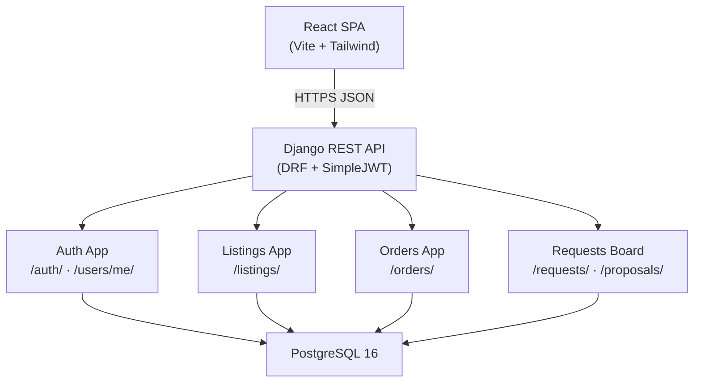
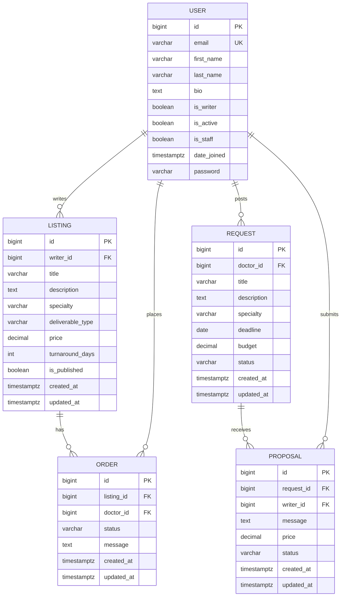

# Kessia — Technical Documentation (Stage 3)

---

## Table of Contents

1. [Design System Architecture](#1-design-system-architecture)
2. [Components, Classes & Database Design](#2-components-classes--database-design)
3. [High-Level Sequence Diagrams](#3-high-level-sequence-diagrams)
4. [API & Methods](#4-api--methods)
5. [SCM & QA Strategy](#5-scm--qa-strategy)
6. [Technical Justifications](#6-technical-justifications)

---

## 1. Design System Architecture

### 1.1 Architecture Overview

Kessia follows a classic three-tier architecture: a React single-page application on the client side, a Django REST API in the middle, and a PostgreSQL database for persistent storage. Everything is containerised with Docker Compose so that any team member can spin up the full stack with a single command.

```
┌─────────────────────────────────────────────────────────┐
│                      CLIENT (Browser)                   │
│                                                         │
│   React 18 + Vite   │   Zustand (auth state)           │
│   Tailwind CSS      │   TanStack React Query (server)  │
│   React Router v6   │   Axios (HTTP + JWT refresh)     │
└───────────────────────────────┬─────────────────────────┘
                                │  HTTPS / JSON  (port 5173 → 8000)
                                ▼
┌─────────────────────────────────────────────────────────┐
│                  BACKEND API  (Django 5.1)               │
│                                                         │
│  ┌──────────────┐  ┌──────────────┐  ┌──────────────┐  │
│  │  Auth App    │  │ Listings App │  │  Orders App  │  │
│  │ (users)      │  │              │  │              │  │
│  └──────────────┘  └──────────────┘  └──────────────┘  │
│                                                         │
│  ┌──────────────────────────────────────────────────┐   │
│  │              Requests Board App                  │   │
│  │          (requests + proposals)                  │   │
│  └──────────────────────────────────────────────────┘   │
│                                                         │
│  Django REST Framework · SimpleJWT · drf-spectacular    │
└───────────────────────────────┬─────────────────────────┘
                                │  Django ORM / psycopg
                                ▼
┌─────────────────────────────────────────────────────────┐
│              DATABASE  (PostgreSQL 16)                  │
│                                                         │
│   users · listings · orders · requests · proposals      │
└─────────────────────────────────────────────────────────┘
```



### 1.2 Data Flow

**Standard request cycle**

```
Client (React)
  → Axios (attaches Bearer token)
    → Django REST Framework
      → Permission checks (JWT validated by SimpleJWT)
        → ViewSet / View logic
          → ORM query (psycopg → PostgreSQL)
            → Serializer (model → JSON)
              → HTTP Response → React UI update
```

**Token refresh cycle** (transparent to the user)

```
Axios 401 interceptor fires
  → POST /api/v1/auth/refresh/  (sends stored refreshToken)
    → SimpleJWT validates & rotates both tokens
      → Zustand stores new accessToken (memory) + refreshToken (localStorage)
        → Original request retried with new token
```

**Step-by-step for the main flows**

| Step | Actor | Action |
|------|-------|--------|
| 1 | Client | Sends HTTP request with `Authorization: Bearer <access_token>` |
| 2 | Django | Validates JWT, resolves `request.user` |
| 3 | ViewSet | Runs permission classes, then business logic |
| 4 | ORM | Reads / writes PostgreSQL via psycopg |
| 5 | Serializer | Converts model instances to JSON |
| 6 | Client | React Query caches the response; UI re-renders |

---

## 2. Components, Classes & Database Design

### 2.1 Front-end Components (React)

#### Pages

| Page | Route | Role | Purpose |
|------|-------|------|---------|
| `Landing` | `/` | Public | Value proposition, sign-up CTA, platform overview |
| `Register` | `/register` | Public | Account creation (email, password, name) |
| `Login` | `/login` | Public | Email + password login |
| `Listings` | `/listings` | Public | Public catalog of writer services with filters |
| `ListingDetail` | `/listings/:id` | Public | Full service detail page + "Place Order" CTA |
| `ListingFormPage` | `/listings/new` · `/listings/:id/edit` | Writer only | Create / edit a listing |
| `Requests` | `/requests` | Public | Public board of open doctor writing requests |
| `RequestDetail` | `/requests/:id` | Public | Full request detail + proposal submission |
| `RequestFormPage` | `/requests/new` · `/requests/:id/edit` | Authenticated | Post / edit a writing request |
| `DashboardWriter` | `/dashboard/writer` | Writer only | Writer's listings + incoming orders |
| `DashboardDoctor` | `/dashboard/doctor` | Authenticated | Doctor's placed orders and statuses |
| `NotFound` | `*` | Public | 404 fallback |

#### UI & Layout Components

| Component | Type | Purpose |
|-----------|------|---------|
| `Navbar` | Layout | Top navigation: logo, links, auth state, role-based menu |
| `Footer` | Layout | Site footer |
| `ProtectedRoute` | Guard | Redirects to `/login` if user is not authenticated |
| `WriterRoute` | Guard | Redirects to `/login` if user is not authenticated **or** is not a writer |
| `Tabs` | Layout | Tab switching UI used in dashboards |
| `ListingCard` | Feature | Compact listing preview (specialty, price, turnaround, writer name) |
| `ListingFilters` | Feature | Filter sidebar: specialty + deliverable type selects |
| `ListingForm` | Feature | Controlled form for creating/editing listings |
| `OrderRow` | Feature | Single row in the orders table (status badge + actions) |
| `PlaceOrderModal` | Feature | Modal with message field to confirm an order |
| `RequestCard` | Feature | Compact request preview on the public board |
| `RequestForm` | Feature | Controlled form for creating/editing requests |
| `ProposalForm` | Feature | Writer proposal submission form (message + price) |
| `ProposalRow` | Feature | Single row in the proposals list with accept/reject actions |
| `Button` | UI | Reusable button (variants: primary, outline, ghost; sizes: sm, md, lg) |
| `Card` | UI | White rounded container |
| `Input` | UI | Labelled text input |
| `Textarea` | UI | Labelled multi-line input |
| `Select` | UI | Labelled dropdown |
| `Modal` | UI | Accessible overlay dialog |
| `Badge` | UI | Inline label chip |
| `StatusBadge` | UI | Colour-coded badge for order/proposal status |

#### State Management

| Layer | Tool | Responsibility |
|-------|------|---------------|
| Auth state | Zustand (`authStore`) | Stores `accessToken` (memory), `refreshToken` + `user` (localStorage) |
| Server state | TanStack React Query | Caching, background refetch, optimistic updates for API data |
| HTTP | Axios (`api` client) | Base URL, JWT injection, silent token refresh on 401 |

**Component interaction examples**

- Doctor on `ListingDetail` clicks **Place Order** → `PlaceOrderModal` opens → `POST /api/v1/orders/` → React Query invalidates orders cache → `DashboardDoctor` reflects new order.
- Writer on `DashboardWriter` clicks **Accept** on an `OrderRow` → `PATCH /api/v1/orders/{id}/` with `{ "status": "accepted" }` → order status badge updates.
- Unauthenticated user visits `/listings/new` → `WriterRoute` reads Zustand store → redirects to `/login`.

---

### 2.2 Back-end Apps & Classes (Django)

The backend is organised into four Django apps. Each app owns a **ViewSet** (routing + HTTP logic), a **Serializer** layer (validation + shape), and a **Model** (database).

#### App responsibility map

| App | Models | Key Responsibility |
|-----|--------|--------------------|
| `users` | `User` | Custom auth model, JWT issue/refresh/logout, writer activation |
| `listings` | `Listing` | Writer service offers: CRUD, public catalog, filtering |
| `orders` | `Order` | Doctor order placement; writer status transitions |
| `requests_board` | `Request`, `Proposal` | Reverse marketplace: doctors post needs, writers respond |

#### `users` app

```
User (AbstractBaseUser + PermissionsMixin)
├── email          EmailField  — login identifier (unique)
├── first_name     CharField
├── last_name      CharField
├── bio            TextField   — optional writer bio
├── is_writer      BooleanField — activated by POST /users/me/activate-writer/
├── is_active      BooleanField
├── is_staff       BooleanField — Django admin access
└── date_joined    DateTimeField

Views / Endpoints
├── register()           — POST /auth/register/
├── TokenObtainPairView  — POST /auth/login/     (SimpleJWT)
├── TokenRefreshView     — POST /auth/refresh/   (SimpleJWT)
├── LogoutView           — POST /auth/logout/    (blacklists refresh token)
├── MeView (GET/PATCH)   — /users/me/
└── activate_writer()    — POST /users/me/activate-writer/
```

#### `listings` app

```
Listing
├── writer          FK → User  (cascade on delete)
├── title           CharField
├── description     TextField
├── specialty       CharField  (choices: Specialty enum)
├── deliverable_type CharField  (choices: DeliverableType enum)
├── price           DecimalField
├── turnaround_days PositiveIntegerField
├── is_published    BooleanField
├── created_at      DateTimeField (auto)
└── updated_at      DateTimeField (auto)

Permissions
├── list / retrieve  → AllowAny
├── create           → IsAuthenticated + IsWriter
└── update / delete  → IsAuthenticated + IsWriter + IsListingOwner
```

#### `orders` app

```
Order
├── listing    FK → Listing   (PROTECT — prevents deleting a listed service with open orders)
├── doctor     FK → User
├── status     CharField      (pending → accepted | declined ; accepted → delivered)
├── message    TextField      (optional context from the doctor)
├── created_at DateTimeField (auto)
└── updated_at DateTimeField (auto)

Permissions
├── list / create  → IsAuthenticated
├── retrieve       → IsAuthenticated + IsOrderParticipant (doctor OR listing writer)
└── update         → IsAuthenticated + IsOrderWriter (listing writer only)
```

#### `requests_board` app

```
Request
├── doctor      FK → User
├── title       CharField
├── description TextField
├── specialty   CharField  (Specialty enum)
├── deadline    DateField
├── budget      DecimalField
├── status      CharField  (open | closed)
├── created_at  DateTimeField (auto)
└── updated_at  DateTimeField (auto)

Proposal
├── request  FK → Request  (cascade)
├── writer   FK → User     (cascade)
├── message  TextField
├── price    DecimalField
├── status   CharField     (pending → accepted | rejected)
├── created_at DateTimeField (auto)
└── updated_at DateTimeField (auto)
Constraint: unique_together(request, writer) — one proposal per writer per request

Permissions
├── Request list / retrieve → AllowAny
├── Request create          → IsAuthenticated
├── Request update / delete → IsAuthenticated + IsRequestOwner
├── Proposals GET           → IsAuthenticated (doctor sees all; writer sees own)
├── Proposals POST          → IsAuthenticated + IsWriter
├── Proposal PATCH          → IsAuthenticated + IsProposalRequestOwner (doctor accepts/rejects)
└── Proposal DELETE         → IsAuthenticated + IsWriter + IsProposalWriter
```

#### Shared enum values (`common/choices.py`)

| Enum | Values |
|------|--------|
| `Specialty` | general_medicine, cardiology, oncology, neurology, pediatrics, surgery, psychiatry, radiology, dermatology, endocrinology, gastroenterology, other |
| `DeliverableType` | research_paper, review_article, case_report, abstract, other |

---

### 2.3 Database Schema (PostgreSQL)



#### Table summary

| Table | What it represents | Key relationships |
|-------|--------------------|-------------------|
| `users_user` | All platform users (doctors and writers share one table; `is_writer` flag differentiates roles) | Referenced by all other tables |
| `listings_listing` | Writer service offers | `writer_id → users_user` |
| `orders_order` | A doctor's order on a specific listing | `listing_id → listings_listing`, `doctor_id → users_user` |
| `requests_request` | A doctor's open writing request (reverse listing) | `doctor_id → users_user` |
| `requests_proposal` | A writer's response to a request | `request_id → requests_request`, `writer_id → users_user` |

#### State machines

**Order status**

```
PENDING ──► ACCEPTED ──► DELIVERED
        │
        └──► DECLINED
```

**Proposal status**

```
PENDING ──► ACCEPTED
        │
        └──► REJECTED
```

---

## 3. High-Level Sequence Diagrams

Three critical user flows cover the main paths through the MVP.

### 3.1 User Registration & Login (JWT)

```mermaid
sequenceDiagram
    actor User
    participant FE as React Frontend
    participant BE as Django API
    participant DB as PostgreSQL

    User->>FE: Fills registration form (email, password, name)
    FE->>BE: POST /api/v1/auth/register/
    BE->>DB: INSERT INTO users_user
    DB-->>BE: User row created
    BE-->>FE: { user, access_token, refresh_token }
    FE->>FE: Zustand stores tokens; user redirected to catalog

    Note over User,DB: Later — Login

    User->>FE: Fills login form (email, password)
    FE->>BE: POST /api/v1/auth/login/
    BE->>DB: SELECT user WHERE email = ? ; check password hash
    DB-->>BE: User record
    BE-->>FE: { access_token, refresh_token }
    FE->>FE: Zustand updates store; user redirected

    Note over FE,BE: Silent token refresh (access expires after 15 min)
    FE->>BE: Any request → 401 Unauthorized
    FE->>BE: POST /api/v1/auth/refresh/  { refresh_token }
    BE->>DB: Validate & blacklist old refresh token; issue new pair
    DB-->>BE: OK
    BE-->>FE: { new_access_token, new_refresh_token }
    FE->>BE: Retries original request with new token
```

**Explanation**

1. User fills the form → React sends `POST /auth/register/`.
2. Django creates the user, hashes the password, and immediately returns both tokens (no separate login step needed after registration).
3. Zustand stores `accessToken` in memory and `refreshToken` in localStorage.
4. When the 15-minute access token expires, the Axios response interceptor catches the 401, silently requests a new pair via `POST /auth/refresh/`, updates the store, and retries the original request — the user notices nothing.
5. On logout, the refresh token is blacklisted in the database (`rest_framework_simplejwt.token_blacklist`), invalidating all future refresh attempts with that token.

---

### 3.2 Browse Listings & Place an Order (Doctor Flow)

```mermaid
sequenceDiagram
    actor Doctor
    participant FE as React Frontend
    participant BE as Django API
    participant DB as PostgreSQL

    Doctor->>FE: Opens /listings page
    FE->>BE: GET /api/v1/listings/  [no auth required]
    BE->>DB: SELECT listings WHERE is_published=true (+ optional filters)
    DB-->>BE: Listing rows
    BE-->>FE: [ { id, title, specialty, price, turnaround_days, writer_name }, … ]
    FE->>FE: Renders ListingCard grid

    Doctor->>FE: Clicks a listing card
    FE->>BE: GET /api/v1/listings/{id}/
    BE->>DB: SELECT listing + writer info
    DB-->>BE: Listing detail row
    BE-->>FE: { id, title, description, writer { bio, … }, price, … }
    FE->>FE: Renders ListingDetail page with "Place Order" button

    Doctor->>FE: Clicks "Place Order" → fills PlaceOrderModal
    FE->>BE: POST /api/v1/orders/  { listing: id, message: "…" }
    Note over BE: JWT validated; listing ownership ≠ doctor; is_published=true
    BE->>DB: INSERT INTO orders_order  (status=pending)
    DB-->>BE: Order row
    BE-->>FE: { id, listing, doctor, status: "pending", … }
    FE->>FE: React Query invalidates orders; modal closes; toast shown
```

**Explanation**

1. The catalog page is public — no login required. Django returns only published listings.
2. Filters (`specialty`, `deliverable_type`) are passed as query parameters; the backend handles them via `django-filter`.
3. On order creation, the backend validates that the doctor is not ordering their own listing and that the listing is published. The order is created with status `pending`.
4. The writer will see the new order on their `DashboardWriter` the next time they load it.

---

### 3.3 Post a Request & Submit a Proposal (Reverse Marketplace Flow)

```mermaid
sequenceDiagram
    actor Doctor
    actor Writer
    participant FE as React Frontend
    participant BE as Django API
    participant DB as PostgreSQL

    Doctor->>FE: Fills RequestFormPage (title, specialty, deadline, budget)
    FE->>BE: POST /api/v1/requests/  { title, specialty, deadline, budget, description }
    BE->>DB: INSERT INTO requests_request  (status=open)
    DB-->>BE: Request row
    BE-->>FE: Request detail JSON
    FE->>FE: Redirects Doctor to /requests/{id}

    Note over Writer,DB: Writer browses the board

    Writer->>FE: Opens /requests
    FE->>BE: GET /api/v1/requests/  [no auth required]
    BE->>DB: SELECT open requests + proposals_count
    DB-->>BE: Request rows
    BE-->>FE: Request list JSON
    FE->>FE: Renders RequestCard board

    Writer->>FE: Opens RequestDetail page → fills ProposalForm
    FE->>BE: POST /api/v1/requests/{id}/proposals/  { message, price }
    Note over BE: is_writer=true; unique constraint enforced
    BE->>DB: INSERT INTO requests_proposal  (status=pending)
    DB-->>BE: Proposal row
    BE-->>FE: Proposal JSON
    FE->>FE: Writer sees their pending proposal

    Note over Doctor,DB: Doctor reviews and accepts

    Doctor->>FE: Opens RequestDetail → sees proposals list
    FE->>BE: GET /api/v1/requests/{id}/proposals/
    BE->>DB: SELECT proposals WHERE request_id=?
    DB-->>BE: Proposal rows (full list for request owner)
    BE-->>FE: Proposals JSON
    Doctor->>FE: Clicks "Accept" on a proposal
    FE->>BE: PATCH /api/v1/proposals/{id}/  { status: "accepted" }
    Note over BE: IsProposalRequestOwner check passes
    BE->>DB: UPDATE requests_proposal SET status='accepted'
    DB-->>BE: Updated row
    BE-->>FE: Updated proposal JSON
    FE->>FE: ProposalRow updates status badge
```

**Explanation**

1. Any authenticated user can post a request (doctors mainly; the permission is `IsAuthenticated` rather than a role check, allowing flexibility).
2. The requests board is public — writers can browse without an account and only need to log in to submit a proposal.
3. The unique constraint `(request, writer)` in the database prevents a writer from submitting twice on the same request; this is validated at the serializer level before the DB insert.
4. The doctor (request owner) sees **all** proposals; a writer can only see their own via the scoped queryset.
5. When the doctor accepts a proposal, the `status` transitions from `pending` to `accepted`. The state machine in `ProposalUpdateSerializer` enforces valid transitions.

---

## 4. API & Methods

### 4.1 External APIs

No external API is used in the MVP. The table below lists integrations planned for later stages.

| API / Service | Purpose | Stage | Why chosen |
|---------------|---------|-------|-----------|
| **Stripe** (Stripe Connect) | Secure payments + escrow logic (funds held until delivery confirmed) | Should Have | Industry-standard payment gateway; well-documented Python/Django SDK; Connect tier supports marketplace fund-holding |
| **SendGrid / Mailgun** | Transactional emails (order placed, status changes, proposal received) | Could Have | Simple HTTP API; generous free tier for low volume |
| **Twilio** | SMS notifications as an alternative notification channel | Could Have | Wide coverage; easy Django integration |
| **Mapbox / Google Maps** | Address validation, delivery zone visualization | Future | Relevant only if a physical delivery dimension is added |

### 4.2 Internal API Endpoints (MVP)

All endpoints are prefixed with `/api/v1/`. All inputs and outputs use **JSON**. Protected endpoints require `Authorization: Bearer <access_token>`.

The full interactive specification is available via **Swagger UI** at `/api/docs/` (powered by `drf-spectacular`).

---

#### Authentication & Users

| Method | Endpoint | Auth | Description | Input | Output |
|--------|----------|------|-------------|-------|--------|
| `POST` | `/auth/register/` | None | Create account + receive tokens | `{ "email": "str", "password": "str", "first_name": "str", "last_name": "str" }` | `{ "user": {...}, "access": "jwt", "refresh": "jwt" }` |
| `POST` | `/auth/login/` | None | Log in; receive token pair | `{ "email": "str", "password": "str" }` | `{ "access": "jwt", "refresh": "jwt" }` |
| `POST` | `/auth/refresh/` | Refresh token | Rotate and return a new token pair | `{ "refresh": "jwt" }` | `{ "access": "jwt", "refresh": "jwt" }` |
| `POST` | `/auth/logout/` | JWT | Blacklist the refresh token | `{ "refresh": "jwt" }` | `205 Reset Content` |
| `GET` | `/users/me/` | JWT | Get current user profile | — | `{ "id", "email", "first_name", "last_name", "bio", "is_writer", "date_joined" }` |
| `PATCH` | `/users/me/` | JWT | Update profile fields | `{ "first_name"?, "last_name"?, "bio"? }` | Updated user object |
| `POST` | `/users/me/activate-writer/` | JWT | Activate writer mode on account | — | Updated user object (`is_writer: true`) |

---

#### Service Listings

| Method | Endpoint | Auth | Description | Input | Output |
|--------|----------|------|-------------|-------|--------|
| `GET` | `/listings/` | None | List published listings. Supports filters: `specialty`, `deliverable_type`, `is_published`. Supports search on `title`/`description`. Ordering by `created_at`, `price`, `turnaround_days`. Pagination (20/page). | Query params | `{ count, next, previous, results: [ ListingListSerializer ] }` |
| `POST` | `/listings/` | JWT + is_writer | Create a new listing | `{ "title", "description", "specialty", "deliverable_type", "price", "turnaround_days", "is_published"? }` | Listing detail object |
| `GET` | `/listings/{id}/` | None | Retrieve a single listing with full writer info | — | Listing detail with nested writer |
| `PATCH` | `/listings/{id}/` | JWT + owner | Partially update a listing | Any subset of write fields | Updated listing detail |
| `PUT` | `/listings/{id}/` | JWT + owner | Full update a listing | All write fields | Updated listing detail |
| `DELETE` | `/listings/{id}/` | JWT + owner | Delete a listing | — | `204 No Content` |

---

#### Orders

| Method | Endpoint | Auth | Description | Input | Output |
|--------|----------|------|-------------|-------|--------|
| `GET` | `/orders/` | JWT | List orders visible to the current user (doctor: own orders; writer: orders on their listings). Filter by `status`. | Query params | Paginated order list |
| `POST` | `/orders/` | JWT | Place an order on a listing | `{ "listing": id, "message"?: "str" }` | Full order detail |
| `GET` | `/orders/{id}/` | JWT + participant | Get a single order (accessible to doctor or writer) | — | Full order detail |
| `PATCH` | `/orders/{id}/` | JWT + writer | Update order status (writer only). Enforces state machine. | `{ "status": "accepted" \| "declined" \| "delivered" }` | Updated order detail |

**Order state machine:** `pending → accepted | declined` ; `accepted → delivered`

---

#### Writing Requests & Proposals

| Method | Endpoint | Auth | Description | Input | Output |
|--------|----------|------|-------------|-------|--------|
| `GET` | `/requests/` | None | List open requests. Filter by `specialty`, `status`. Search on `title`/`description`. Includes `proposals_count`. | Query params | Paginated request list |
| `POST` | `/requests/` | JWT | Post a new writing request | `{ "title", "description", "specialty", "deadline", "budget" }` | Request detail |
| `GET` | `/requests/{id}/` | None | Retrieve a single request | — | Request detail |
| `PATCH` | `/requests/{id}/` | JWT + owner | Update a request (e.g. close it) | Subset of write fields | Updated request detail |
| `PUT` | `/requests/{id}/` | JWT + owner | Full update | All write fields | Updated request detail |
| `DELETE` | `/requests/{id}/` | JWT + owner | Delete a request | — | `204 No Content` |
| `GET` | `/requests/{id}/proposals/` | JWT | List proposals on a request. Doctor sees all; writer sees only their own. | — | Proposal list |
| `POST` | `/requests/{id}/proposals/` | JWT + is_writer | Submit a proposal | `{ "message": "str", "price": decimal }` | Proposal object |
| `PATCH` | `/proposals/{id}/` | JWT + request owner | Accept or reject a proposal | `{ "status": "accepted" \| "rejected" }` | Updated proposal |
| `DELETE` | `/proposals/{id}/` | JWT + proposal writer | Withdraw a proposal (writer only) | — | `204 No Content` |

**Proposal state machine:** `pending → accepted | rejected`

---

#### Schema & Docs

| Method | Endpoint | Auth | Description |
|--------|----------|------|-------------|
| `GET` | `/api/schema/` | None | OpenAPI 3.0 schema (YAML/JSON) |
| `GET` | `/api/docs/` | None | Swagger UI interactive documentation |

---

## 5. SCM & QA Strategy

### 5.1 Source Control Management (Git)

**Repository:** GitHub — `victormonnot/Kessia`

**Branching strategy**

```
main
 └── dev
      ├── feature/auth-views
      ├── feature/listings-crud
      ├── feature/orders-flow
      ├── feature/requests-board
      └── fix/...

technical_doc   (documentation branch — merges into main at milestone)
```

| Branch | Purpose |
|--------|---------|
| `main` | Always contains production-ready, reviewed code. Direct push is blocked; only PR merges allowed. |
| `dev` | Integration branch. Features are merged here after peer review. |
| `feature/*` | One branch per feature or task. Short-lived; deleted after merge. |
| `fix/*` | Bug fixes. Same lifecycle as feature branches. |
| `technical_doc` | Documentation-only branch; tracks Stage 3 deliverables. |

**Workflow**

1. Create a branch from `dev`: `git checkout -b feature/my-feature`.
2. Commit small, atomic changes with clear messages (`feat:`, `fix:`, `docs:`, `refactor:`).
3. Open a Pull Request targeting `dev`.
4. The other developer reviews: checks logic, naming, and tests.
5. PR is merged (squash or merge commit) after approval.
6. Periodically `dev` is merged into `main` when a stable milestone is reached.

**Commit convention (Conventional Commits)**

```
feat: add listing filter by deliverable_type
fix: correct order status transition guard
docs: add sequence diagrams to technical doc
refactor: extract IsOrderParticipant permission class
test: add factory for Proposal model
```

### 5.2 QA Strategy

#### Backend — Pytest + factory_boy

The backend uses `pytest` with `pytest-django` and `factory_boy` for model factories.

| Test type | Tool | What is tested |
|-----------|------|----------------|
| Unit tests | `pytest` | Serializer validation logic, state machine transitions, permission classes |
| Integration tests | `pytest` + DRF `APIClient` | Full request → response cycle for every endpoint; auth, permissions, error cases |
| Factory fixtures | `factory_boy` | Deterministic model creation for test isolation |

Test configuration: `pytest.ini` + `conftest.py` (session-scoped database).

Run tests:
```bash
pytest backend/
```

Existing test files:
- `apps/users/tests/test_auth.py`
- `apps/listings/tests/test_listings.py`
- `apps/orders/tests/test_orders.py`
- `apps/requests_board/tests/test_requests.py`

#### Frontend — Vitest + Testing Library

| Test type | Tool | What is tested |
|-----------|------|----------------|
| Unit / component tests | `vitest` + `@testing-library/react` | UI components in isolation (e.g. `Button`, `Login` page form behaviour) |
| Hook tests | `vitest` | Custom hooks (e.g. `useListings`) |
| User-event tests | `@testing-library/user-event` | Click, type, submit interactions |

Run tests:
```bash
cd frontend && npm test
```

Existing test files:
- `src/components/ui/Button.test.jsx`
- `src/pages/Login.test.jsx`
- `src/hooks/useListings.test.jsx`

#### Manual QA & API testing

| Tool | Use |
|------|-----|
| **Postman** | Manual testing of all API endpoints; auth flows, edge cases, error responses |
| **Swagger UI** (`/api/docs/`) | Quick in-browser API exploration during development |
| **ESLint** | Frontend code quality (`eslint-plugin-react`, `react-hooks`, `react-refresh`) |
| **Prettier** | Code formatting consistency (frontend) |

#### Code quality (backend)

`pyproject.toml` configures linting and formatting tools. The `requirements-dev.txt` lists development-only dependencies.

### 5.3 Deployment Pipeline

**Environments**

| Environment | Purpose | Config |
|-------------|---------|--------|
| **Local (Docker Compose)** | Developer machine — full stack in one command | `.env` from `.env.example`; `DJANGO_DEBUG=True` |
| **Staging** | Pre-production review; real DB, Stripe test keys | Railway/Render preview environment |
| **Production** | Live platform | Railway/Render production; `DJANGO_DEBUG=False`; real Stripe keys |

**Infrastructure (Docker Compose)**

```yaml
services:
  db:       PostgreSQL 16 (healthcheck before backend starts)
  backend:  Django — runs migrations then gunicorn/runserver
  frontend: Vite dev server (replaced by nginx + static build in production)
```

**Planned CI/CD pipeline (GitHub Actions)**

```
Push to dev or PR to main
  ├── Backend job
  │     ├── pip install
  │     ├── pytest (fail = block merge)
  │     └── lint check
  └── Frontend job
        ├── npm ci
        ├── vitest (fail = block merge)
        └── eslint check

Merge to main
  └── Deploy to staging (Railway/Render)
        └── Manual smoke test (login → browse → order)
              └── Tag release → deploy to production
```

**Steps to deploy manually (MVP)**

1. Push code to `main`.
2. Railway/Render picks up the new commit and rebuilds the Docker image.
3. `python manage.py migrate --noinput` runs automatically on container start.
4. Verify the staging environment: register → list → order flow.
5. Promote to production.

---

## 6. Technical Justifications

### Why Django (Python) for the backend?

| Criterion | Rationale |
|-----------|-----------|
| **Built-in admin panel** | Django's `/admin/` gives us a free content management interface for moderating listings, users, and orders during early operations — no custom admin UI needed for the MVP. |
| **ORM maturity** | Django ORM handles complex queries (filtering, annotations like `proposals_count`) cleanly, and `select_related` / `prefetch_related` avoid N+1 problems out of the box. |
| **Auth ecosystem** | `AbstractBaseUser` + SimpleJWT gives us a fully custom user model with JWT in one weekend. The `token_blacklist` module handles secure logout without additional infrastructure. |
| **DRF + drf-spectacular** | Django REST Framework provides serializers, viewsets, permissions, filtering, pagination — essentially a complete API toolkit. `drf-spectacular` auto-generates an OpenAPI 3.0 spec and Swagger UI for free. |
| **Team familiarity** | The backend lead has Python/Django experience from the Holberton curriculum (HBNB project), reducing ramp-up time. |

### Why React + Vite + Tailwind CSS for the frontend?

| Criterion | Rationale |
|-----------|-----------|
| **React** | Component model suits a two-sided marketplace with role-conditional UI (writer vs. doctor dashboards, `WriterRoute` guards). The ecosystem (React Query, React Router, Zustand) covers every frontend need. |
| **Vite** | Dramatically faster dev server than Create React App; first-class Vitest integration for testing. |
| **Tailwind CSS** | Utility-first CSS enables rapid UI iteration without leaving JSX. Consistent design system from a single `tailwind.config.js`. No context-switching between stylesheet files. |
| **TanStack React Query** | Declarative server-state management; automatic background refetch and cache invalidation means the dashboards stay in sync without manual `useEffect` polling. |
| **Zustand** | Minimal auth state store (< 35 lines of code). Simpler than Redux; `persist` middleware handles localStorage serialization with `partialize` to avoid storing short-lived access tokens. |

### Why PostgreSQL?

| Criterion | Rationale |
|-----------|-----------|
| **Relational integrity** | The marketplace has clear relational structure (user → listings → orders; requests → proposals). FK constraints and unique constraints (`unique_proposal_per_writer`) are enforced at the DB level. |
| **`PROTECT` on FK** | `Order.listing` uses `on_delete=PROTECT`, so a writer cannot accidentally delete a service that has existing orders. This is enforced at the database, not just the application layer. |
| **Future-proofing** | PostgreSQL's JSONB columns and full-text search (pg_trgm) can handle future features like structured portfolio items or full-text search across listings without migrating to a different database. |

### Why Docker Compose?

Any developer can run `docker compose up` and have the full stack (PostgreSQL + Django + React) running in under two minutes, regardless of local OS. This eliminates "works on my machine" issues for a 2-person remote team.

### Why SimpleJWT with `ROTATE_REFRESH_TOKENS`?

Short-lived access tokens (15 min) minimise the window of abuse if a token is intercepted. Rotating refresh tokens mean each refresh call invalidates the previous refresh token and issues a new one — if a refresh token is stolen and used, the legitimate user's next refresh will fail, alerting them to the compromise. The `token_blacklist` table persists invalidated tokens across server restarts.

### Ethics & Compliance Note

Kessia is explicitly a **declared medical writing** platform. The product is scoped to avoid facilitating undisclosed ghostwriting, in line with ICMJE authorship guidelines and COPE principles. The Terms of Service (planned for production) will require writers and doctors to acknowledge that any writing contribution must be declared in the publication's authorship or acknowledgments section. The MVP deliberately defers patient data features — no PHI (protected health information) transits through the platform in v1, keeping GDPR / HIPAA exposure minimal.
