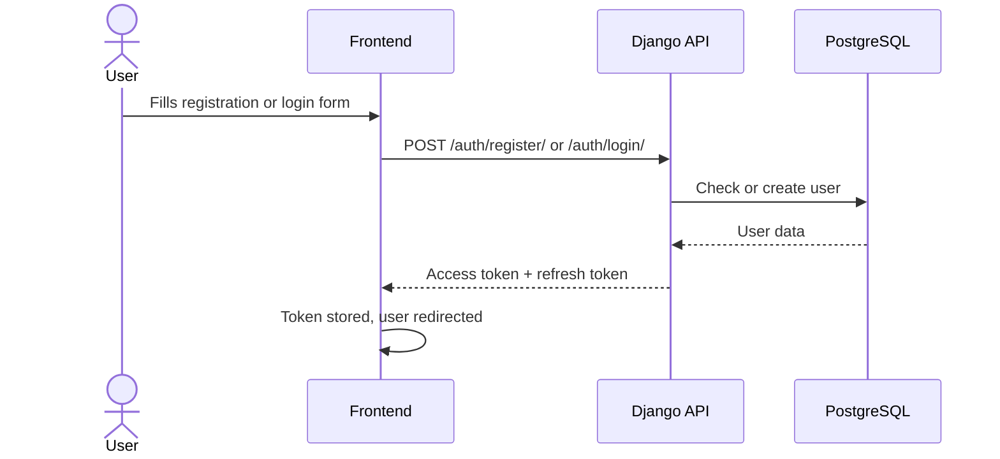
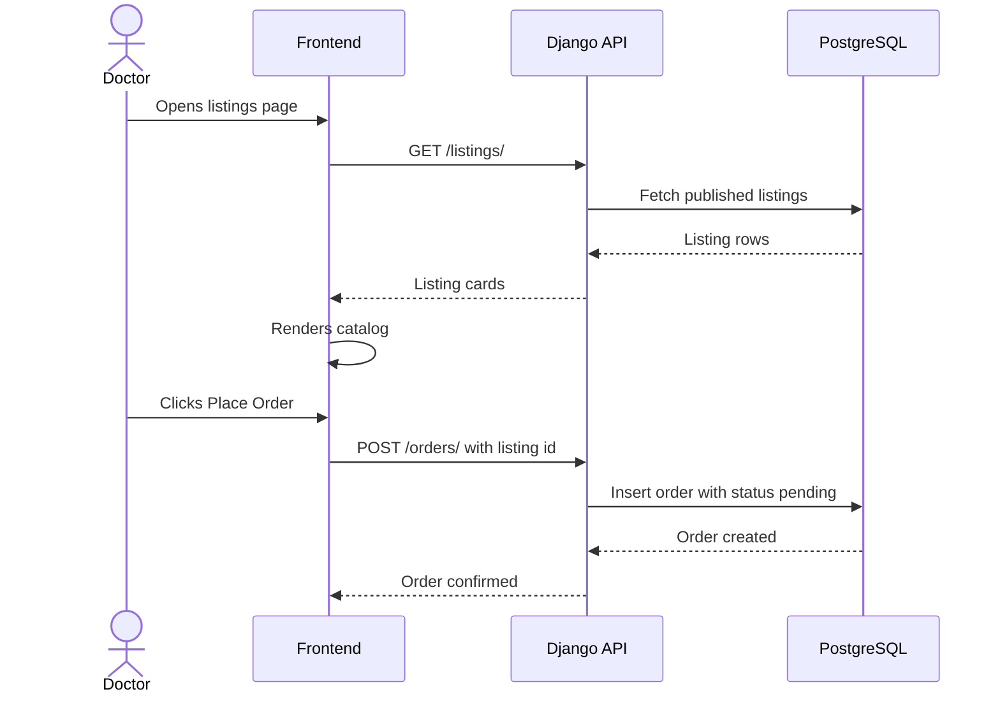
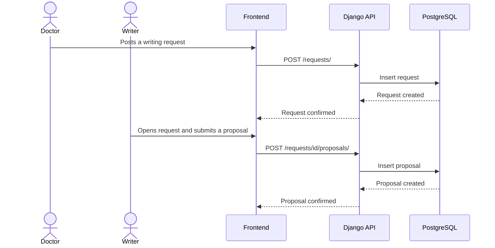

# Kessia — Technical Documentation (Stage 3)

---

## Table of Contents

1. [User Stories](#1-user-stories)
2. [System Architecture](#2-system-architecture)
3. [Components, Classes & Database Design](#3-components-classes--database-design)
4. [Sequence Diagrams](#4-sequence-diagrams)
5. [API & Methods](#5-api--methods)
6. [SCM & QA Strategy](#6-scm--qa-strategy)
7. [Technical Justifications](#7-technical-justifications)

---

## 1. User Stories

Kessia has three actor types: **Writer** (activated writer mode), **Doctor / Institution** (default after sign-up), and **Admin** (platform operator). Stories are prioritized using **MoSCoW**.

### Must Have

| Area | Story |
|------|-------|
| Auth | As a visitor, I want to sign up with email and password. |
| Auth | As a registered user, I want to log in and out. |
| Auth | As a user, I want to activate writer mode to unlock listing creation. |
| Listings | As a writer, I want to create a listing with title, description, specialty, deliverable type, price, and turnaround. |
| Listings | As a writer, I want to edit or delete my listings. |
| Browse | As a doctor, I want to browse all published listings. |
| Browse | As a doctor, I want to filter listings by specialty and deliverable type. |
| Browse | As a doctor, I want to view a full service detail page including writer info. |
| Orders | As a doctor, I want to place an order from a service page. |
| Orders | As a doctor, I want to see my order ID and status after placing an order. |
| Orders | As a writer, I want to accept, decline, or mark an order as delivered. |
| Orders | As a doctor, I want to see the status of my orders (pending / accepted / declined / delivered). |
| Orders | As a writer, I want to see all orders linked to my listings with their statuses. |
| Requests | As a doctor, I want to post a writing request with topic, specialty, deadline, and budget. |
| Requests | As a writer, I want to browse open requests and submit a proposal. |
| UI | As any user, I want the platform to work on mobile. |

### Should Have

| Area | Story |
|------|-------|
| Dashboard | As a doctor, I want a dashboard showing all my orders and their statuses. |
| Dashboard | As a writer, I want a dashboard showing my listings and incoming orders. |
| Profile | As a doctor, I want to view a writer's public profile (bio, specialties, active listings). |
| Profile | As a writer, I want a public profile page to present my background and services. |
| Admin | As an admin, I want to view all registered users and their roles. |
| Admin | As an admin, I want to deactivate or remove a listing that violates platform terms. |
| Payments | As a doctor, I want to pay securely through the platform via Stripe. |
| Payments | As a writer, I want payments held in escrow and released upon delivery confirmation. |
| Messaging | As a doctor, I want to message a writer after placing an order. |
| Messaging | As a writer, I want to reply to client messages within the platform. |
| Badges | As a writer, I want to request a verified specialty badge by submitting my credentials. |
| Badges | As a doctor, I want to see verified badges on writer profiles and listings. |
| Badges | As an admin, I want to review badge requests and approve or reject them. |

### Could Have

| Area | Story |
|------|-------|
| Notifications | As any user, I want email notifications for key events (order placed, accepted, delivered). |

### Won't Have (v1)

- **International scaling** — i18n, multi-currency, and tax compliance are deferred until the model is validated.

---

### Mockup Screens

| Screen | Key Elements |
|--------|-------------|
| Landing | Value proposition, sign-up CTA |
| Registration | Email, password, profile fields, role selection |
| Login | Email + password |
| Listings Catalog | Listing cards (specialty, price, turnaround), filter sidebar |
| Service Detail | Full listing, writer info panel, "Place Order" CTA |
| Order Confirmation | Order summary, status badge |
| Writer Dashboard | Listings table, incoming orders with status + actions |
| Doctor Dashboard | Placed orders table with status tracking |
| Create / Edit Listing | Title, description, specialty, deliverable type, price, turnaround |

> Wireframes are available at [MockupV1.html](https://victormonnot.github.io/Kessia/MockupV1.html).

---

## 2. System Architecture

Kessia is a three-tier application: a React SPA on the client, a Django REST API in the middle, and a PostgreSQL database for persistence. The full stack runs locally via Docker Compose.


**Data flow in short:**
Client sends a request with a JWT token → Django validates it and routes to the correct app → the ORM reads or writes PostgreSQL → the result is serialised to JSON and returned to the frontend.

---

## 3. Components, Classes & Database Design

### 3.1 Frontend Pages

| Page | Route | Access | Purpose |
|------|-------|--------|---------|
| Landing | `/` | Public | Homepage with sign-up CTA |
| Register / Login | `/register` `/login` | Public | Account creation and login |
| Listings | `/listings` | Public | Browse writer service catalog |
| Listing Detail | `/listings/:id` | Public | Full offer + Place Order button |
| Listing Form | `/listings/new` `/listings/:id/edit` | Writer | Create or edit a listing |
| Requests | `/requests` | Public | Board of open writing requests |
| Request Detail | `/requests/:id` | Public | Full request + proposal form |
| Request Form | `/requests/new` | Authenticated | Post a writing request |
| Writer Profile | `/redacteurs/:id` | Public | Shareable profile: bio, specialties, listings, rating, badge |
| Dashboard Writer | `/dashboard/writer` | Writer | Listings, incoming orders + actions, proposals, earnings/payouts, verification |
| Dashboard Doctor | `/dashboard/doctor` | Authenticated | Placed orders + payment/tracking, requests, received proposals |
| Messaging | `/messages` `/messages/:id` | Authenticated | Inbox + real-time conversation thread |

**Key UI components:** `ListingCard`, `ListingFilters`, `Pagination`, `PlaceOrderModal`, `OrderActions` (status/pay/deliver/review/contact), `PaymentModal` (Stripe Elements), `Stars`, `RequestCard`, `ProposalForm`, `OrderRow`, `StatusBadge`, `ProtectedRoute`, `WriterRoute`.

**State management:** Zustand holds the in-memory access token + user; TanStack React Query caches server data (and polls messaging); Axios attaches the token, sends the CSRF header, and silently refreshes via the httpOnly cookie on 401.

---

### 3.2 Backend Apps (Django)

| App | Models | Responsibility |
|-----|--------|----------------|
| `users` | `User` | Auth (httpOnly-cookie JWT), writer activation, verified flag, Stripe ids, public profiles |
| `listings` | `Listing` | Service offers: CRUD + public catalog, search/filter, writer rating |
| `orders` | `Order`, `Deliverable` | Engagement lifecycle, amount snapshot, deliverable upload/download |
| `requests_board` | `Request`, `Proposal` | Reverse marketplace; accepting a proposal atomically creates an order |
| `payments` | `StripeEvent` | Stripe Connect onboarding, escrow charge, release, refund, idempotent webhooks |
| `reviews` | `Review` | Completed-order-gated ratings, aggregated onto profiles/listings |
| `messaging` | `Conversation`, `Message` | 1-to-1 chat (REST + Channels WebSocket), unread counts |
| `verification` | `VerificationRequest` | Writer verification requests; admin-approved badge |

**User** — `email` (unique), `first_name`, `last_name`, `bio`, `is_writer`, `is_verified` (badge), `stripe_account_id`, `stripe_charges_enabled`, `stripe_payouts_enabled`, `is_staff`, `date_joined`.

**Listing** — `writer` (FK), `title`, `description`, `specialty`, `deliverable_type`, `price`, `turnaround_days`, `is_published`.

**Order** — the unified engagement. `doctor` (FK), `writer` (FK), nullable `listing` (FK, protected) **or** nullable `proposal` (FK) as origin, `amount` + `currency` (snapshot at order time), `status` (`pending → accepted → in_progress → delivered → completed`, plus `declined`/`cancelled`), `payment_status` (`unpaid → processing → held → released | refunded | failed`), Stripe references, `message`.

**Deliverable** — `order` (FK), `file`, `note`, `uploaded_at`. The finished work; download is access-gated to the doctor once delivered.

**Request** — `doctor` (FK), `title`, `description`, `specialty`, `deadline`, `budget`, `status` (`open | closed`).

**Proposal** — `request` (FK), `writer` (FK), `message`, `price`, `status` (`pending → accepted | rejected`). One proposal per writer per request (DB constraint). Acceptance creates an `Order` and closes the request in one transaction.

**Review** — one-to-one `order`, `doctor` (FK), `writer` (FK), `rating` (1–5), `comment`. Allowed only to the doctor of a completed order.

**Conversation / Message** — a deduped user pair (optionally tied to an `order`) and its messages (`sender`, `body`, `read_at`). Live delivery via a per-conversation WebSocket group.

**VerificationRequest** — `writer` (FK), `credentials`, optional `document`, `status`, `reviewed_by`. Admin approval flips `User.is_verified`.

**StripeEvent** — processed webhook `event_id` log, for idempotent handling.

---

### 3.3 Database Schema

```mermaid
erDiagram
    USER {
        bigint id PK
        varchar email UK
        varchar first_name
        varchar last_name
        text bio
        boolean is_writer
        timestamptz date_joined
    }
    LISTING {
        bigint id PK
        bigint writer_id FK
        varchar title
        varchar specialty
        varchar deliverable_type
        decimal price
        int turnaround_days
        boolean is_published
    }
    ORDER {
        bigint id PK
        bigint listing_id FK "nullable"
        bigint proposal_id FK "nullable"
        bigint doctor_id FK
        bigint writer_id FK
        decimal amount
        varchar status
        varchar payment_status
        text message
    }
    DELIVERABLE {
        bigint id PK
        bigint order_id FK
        varchar file
    }
    REQUEST {
        bigint id PK
        bigint doctor_id FK
        varchar title
        varchar specialty
        date deadline
        decimal budget
        varchar status
    }
    PROPOSAL {
        bigint id PK
        bigint request_id FK
        bigint writer_id FK
        text message
        decimal price
        varchar status
    }
    REVIEW {
        bigint id PK
        bigint order_id FK UK
        bigint writer_id FK
        int rating
    }
    CONVERSATION {
        bigint id PK
        bigint order_id FK "nullable"
    }
    MESSAGE {
        bigint id PK
        bigint conversation_id FK
        bigint sender_id FK
        timestamptz read_at
    }
    VERIFICATIONREQUEST {
        bigint id PK
        bigint writer_id FK
        varchar status
    }

    USER ||--o{ LISTING : "writes"
    LISTING ||--o{ ORDER : "spawns"
    PROPOSAL ||--o{ ORDER : "spawns"
    USER ||--o{ ORDER : "places / fulfils"
    ORDER ||--o{ DELIVERABLE : "has"
    ORDER ||--o| REVIEW : "rated by"
    ORDER ||--o{ CONVERSATION : "discussed in"
    CONVERSATION ||--o{ MESSAGE : "contains"
    USER ||--o{ REQUEST : "posts"
    REQUEST ||--o{ PROPOSAL : "receives"
    USER ||--o{ PROPOSAL : "submits"
    USER ||--o{ VERIFICATIONREQUEST : "requests"
```

**Order status:** `pending → accepted → in_progress → delivered → completed`, with `declined`/`cancelled` as exits. Payment is taken after acceptance (held), released on completion (minus commission), refunded on cancel-after-payment.

**Proposal status:** `pending → accepted | rejected` (acceptance spawns an order).

---

## 4. Sequence Diagrams

### 4.1 Registration & Login



The access token expires after 15 minutes. Axios silently refreshes it in the background — the user is never interrupted.

---

### 4.2 Browse Listings & Place an Order



The catalog is public (no login required). Filters by specialty and deliverable type are supported.

---

### 4.3 Post a Request & Submit a Proposal



The requests board is public. Only writers can submit proposals. The doctor then reviews and accepts or rejects from their dashboard.

---

## 5. API & Methods

### 5.1 External integrations

| Service | Purpose | Status |
|---------|---------|--------|
| Stripe Connect | Payments, escrow, payouts (test mode) | **Implemented** |
| SendGrid / Mailgun (SMTP) | Transactional email | **Implemented** (console in dev) |
| S3-compatible storage | Media (deliverables, verification docs) in prod | **Implemented** (django-storages) |
| Twilio (SMS) | — | Dropped from v1 scope |

### 5.2 Internal Endpoints

All endpoints are prefixed `/api/v1/`. JSON payloads. Protected routes use a JWT
access token (`Authorization: Bearer …`) sent from memory; the refresh token is
an httpOnly cookie. Interactive docs at `/api/docs/` (Swagger UI).

#### Auth & Users

| Method | Endpoint | Auth | Description |
|--------|----------|------|-------------|
| POST | `/auth/register/` | — | Create account; access in body, refresh in httpOnly cookie |
| POST | `/auth/login/` | — | Login; access in body, refresh in cookie |
| POST | `/auth/refresh/` | Refresh cookie + CSRF | Rotate the access token from the cookie |
| POST | `/auth/logout/` | Cookie + CSRF | Blacklist refresh token, clear cookies |
| GET / PATCH | `/users/me/` | JWT | Get or update profile |
| POST | `/users/me/activate-writer/` | JWT | Enable writer mode |
| GET | `/writers/{id}/` | — | Public writer profile (bio, specialties, listings, rating, badge) |

#### Listings

| Method | Endpoint | Auth | Description |
|--------|----------|------|-------------|
| GET | `/listings/` | — | Public catalog (specialty, deliverable, price/turnaround range, min rating, keyword, sort, paginate; `?mine=true`) |
| POST | `/listings/` | Writer | Create a listing |
| GET | `/listings/{id}/` | — | Listing detail with writer info + rating |
| PATCH | `/listings/{id}/` | Owner | Edit listing |
| DELETE | `/listings/{id}/` | Owner | Delete listing |

#### Orders & Deliverables

| Method | Endpoint | Auth | Description |
|--------|----------|------|-------------|
| GET | `/orders/` | JWT | My orders (`?role=doctor|writer`) |
| POST | `/orders/` | JWT | Place an order (snapshots amount/writer) |
| GET | `/orders/earnings/` | JWT | Writer earnings summary (escrow + net) |
| GET | `/orders/{id}/` | Participant | Order detail |
| PATCH | `/orders/{id}/` | Participant | Role-aware status transition |
| GET / POST | `/orders/{id}/deliverables/` | Participant / Writer | List / upload finished work |
| GET | `/orders/{id}/deliverables/{id}/download/` | Gated | Download (doctor, once delivered) |

#### Requests & Proposals

| Method | Endpoint | Auth | Description |
|--------|----------|------|-------------|
| GET | `/requests/` | — | Public board (specialty, budget range, deadline, keyword, sort, paginate; `?mine=true`) |
| POST | `/requests/` | JWT | Post a writing request |
| GET / PATCH / DELETE | `/requests/{id}/` | Owner | Manage a request |
| GET / POST | `/requests/{id}/proposals/` | JWT / Writer | List / submit proposals |
| GET | `/proposals/` | JWT | Proposals I'm involved in (mine + on my requests) |
| PATCH | `/proposals/{id}/` | Request owner | Accept (→ creates an order) or reject |
| DELETE | `/proposals/{id}/` | Proposal writer | Withdraw a proposal |

#### Payments (Stripe Connect)

| Method | Endpoint | Auth | Description |
|--------|----------|------|-------------|
| POST | `/payments/connect/onboard/` | Writer | Start Express onboarding (returns Stripe URL) |
| GET | `/payments/connect/status/` | Writer | Connected-account status |
| POST | `/payments/orders/{id}/pay/` | Doctor | Create a PaymentIntent for an accepted order |
| POST | `/payments/orders/{id}/confirm/` | Doctor | Sync payment after client confirmation (dev fallback) |
| POST | `/payments/webhook/` | Stripe signature | Idempotent webhook (intent succeeded, account updated) |

#### Reviews, Messaging & Verification

| Method | Endpoint | Auth | Description |
|--------|----------|------|-------------|
| GET | `/reviews/?writer={id}` | — | Public reviews for a writer |
| POST | `/reviews/` | Doctor | Review a completed order (once) |
| GET / POST | `/conversations/` | JWT | List my conversations / start one (recipient or order) |
| GET / POST | `/conversations/{id}/messages/` | Participant | Read (marks read) / send a message |
| GET / POST | `/verification/` | JWT / Writer | My verification requests / submit one |

Real-time delivery: WebSocket at `ws/conversations/{id}/`, authenticated via the
access token carried in the connection subprotocol.

---

## 6. SCM & QA Strategy

### 6.1 Source Control

Repository on GitHub. Branching model:

| Branch | Purpose |
|--------|---------|
| `main` | Production-ready code, merged by PR only |
| `dev` | Integration branch for reviewed features |
| `feature/*` | One branch per feature, merged into `dev` |
| `fix/*` | Bug fixes, same lifecycle as feature branches |

Commits follow the Conventional Commits convention (`feat:`, `fix:`, `docs:`, `refactor:`, `test:`).

### 6.2 Testing

| Layer | Tool | What is covered |
|-------|------|-----------------|
| Backend unit & integration | pytest + DRF APIClient (on **Postgres**) | Endpoints, permissions, status transitions, payment flow (Stripe mocked), atomic acceptance, messaging, emails |
| Backend fixtures | factory_boy | Deterministic model creation |
| Frontend components | Vitest + Testing Library | UI components, hooks, user interactions |
| Code quality | ESLint (frontend), Ruff (backend) | Linting and formatting |

### 6.3 Deployment

Environments: **local** (Docker Compose) and **production** (Railway/Render).
The backend runs as **ASGI via Daphne** (`config.asgi:application`) to serve both
REST and WebSockets. Production uses `config/settings/prod.py`: managed Postgres
(`DATABASE_URL`), Redis as the Channels layer (`REDIS_URL`), S3-compatible object
storage for media, WhiteNoise for static files, secure cross-site cookies, and an
SMTP email provider. Full step-by-step instructions and the environment-variable
list are in [`DEPLOYMENT.md`](DEPLOYMENT.md). CI (GitHub Actions) is a documented
next step (see `LIMITATIONS.md`).

---

## 7. Technical Justifications

| Technology | Why we chose it |
|------------|-----------------|
| **Django + DRF** | Built-in admin panel, mature ORM, and DRF covers auth, serializers, permissions, filtering, and pagination out of the box. |
| **SimpleJWT** | Short-lived access tokens (15 min) with rotating refresh tokens minimise token-theft risk. The refresh token is stored in an httpOnly cookie (XSS-safe) with a double-submit CSRF check; the blacklist module handles secure logout. |
| **React + Vite** | Component model fits a role-conditional UI (doctor vs. writer views). Vite is significantly faster than CRA and has built-in Vitest support. |
| **Tailwind CSS** | Utility-first styling allows fast iteration directly in JSX without managing separate stylesheets. |
| **TanStack React Query** | Handles server state (caching, background refetch) declaratively, keeping dashboards in sync; also drives the messaging polling fallback. |
| **Zustand** | Minimal auth store (access token in memory, user persisted). Simpler than Redux. |
| **Stripe Connect** | Express connected accounts + separate charges & transfers give a clean hold-then-release escrow with an application fee, the standard pattern for marketplaces. |
| **Django Channels + Daphne** | Adds WebSockets for live chat on top of the existing REST writes, with an in-memory layer in dev and Redis in prod. |
| **django-storages (S3)** | Deliverables/verification files must survive on ephemeral platform filesystems; object storage is access-gated through the API. |
| **PostgreSQL** | Relational integrity fits the marketplace data model. FK constraints and `on_delete=PROTECT`/`SET_NULL` prevent data loss; `select_for_update` makes proposal acceptance atomic. |
| **Docker Compose** | Any team member can run the full stack in one command, eliminating environment setup issues. |

**Ethics note:** Kessia is a *declared* medical writing platform. In line with ICMJE and COPE guidelines, all writing contributions must be acknowledged in publications. No patient data (PHI) transits through the platform in v1.
