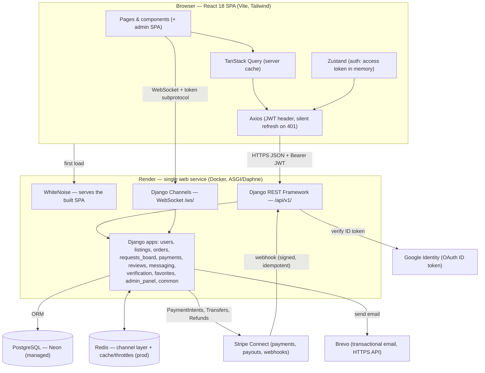
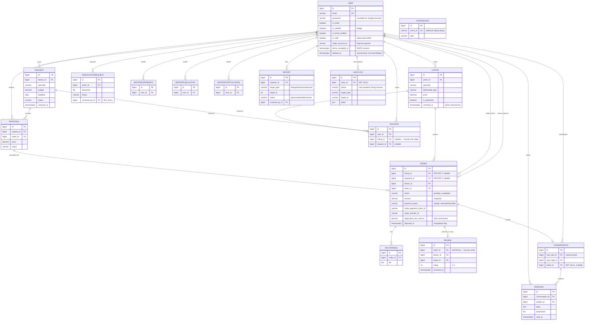

# Kessia — MVP Development & Execution (Stage 4)

> **The single Stage-4 document.** It covers the whole development phase: sprint
> planning, execution, progress monitoring, reviews & retrospectives, final
> integration & QA, the deliverables index, and the Technical Manual Review
> preparation — documenting the MVP **as built** (state of `dev`, 02 Jul 2026).
>
> Companions from previous stages (kept as historical records):
> [`Team Formation, Brainstorming and MVP (Stage 1).md`](<Team%20Formation,%20Brainstorming%20and%20MVP%20(Stage%201).md>) ·
> [`High-LevelPlan.md`](High-LevelPlan.md) (Stage 2) ·
> [`Technical_Documentation_(Stage_3).md`](<Technical_Documentation_(Stage_3).md>) ·
> PO meeting notes in [`Meetings/`](Meetings).

---

## Table of contents

- [0. Context — project & MVP goal](#0-context--project--mvp-goal)
- [1. Team, roles & working model](#1-team-roles--working-model)
- [2. Sprint planning](#2-sprint-planning)
- [3. Executing the development tasks](#3-executing-the-development-tasks)
- [4. Monitoring progress & adjustments](#4-monitoring-progress--adjustments)
- [5. Sprint reviews & retrospectives](#5-sprint-reviews--retrospectives)
- [6. Final integration & QA testing](#6-final-integration--qa-testing)
- [7. Deliverables](#7-deliverables)
- [8. Technical Manual Review preparation](#8-technical-manual-review-preparation)

---

## 0. Context — project & MVP goal

**Kessia** is a two-sided marketplace for **medical & scientific writing**: it
connects **doctors / health institutions** with **freelance scientific writers**.
A single account is a doctor (buyer) by default and can activate a **writer**
profile.

The MVP goal for this stage was to deliver a functional, deployed platform where:

- writers publish **listings** (*annonces*) and doctors publish **requests**
  (*demandes*) answered by writer **proposals** — the dual-publishing model
  validated by the Product Owner;
- an **order** runs through a complete lifecycle (acceptance → work → delivery →
  completion) with secure deliverable exchange, **real-time chat**, gated
  **reviews** and a **verified-writer badge**;
- **money actually moves**: the doctor pays by card once the writer accepts, funds
  are held, and the writer is paid out (minus the platform commission) at
  completion — via Stripe Connect (test mode);
- the platform is **administrable** (moderation, reports, refunds, audit trail)
  and **RGPD-conscious** (consent, cookie banner, anonymising account deletion).

| | |
|---|---|
| **Stack** | Django 5 (LTS) + DRF + Channels · PostgreSQL · React 18 + Vite + Tailwind |
| **Repository** | <https://github.com/victormonnot/Kessia> (code on `dev` → `main`; docs on `technical_doc`) |
| **Staging** | <https://kessia-j1mk.onrender.com> · API docs: <https://kessia-j1mk.onrender.com/api/docs/> |

---

## 1. Team, roles & working model

### 1.1 Roles

| Member | Primary role | Secondary responsibilities |
|--------|--------------|-----------------------------|
| **Soumia Taoui** | Product Owner & Project Sponsor | Backlog prioritisation, acceptance/sign-off, domain expertise |
| **Yasi Philippe Hübner** | Backend Lead | **SCM** (branching, PR reviews, merges), deployment & DevOps, security |
| **Victor Monnot** | Frontend Lead | **QA coordination**, UI/UX, design system |

> In a two-developer team, PM/SCM/QA are not full-time positions; the table
> records who *owns* each concern. Project-management duties (sprint planning,
> deadline tracking) are shared and arbitrated by the PO; the two developers
> **share QA and bug-fixing**.

### 1.2 Working model

- **Iteration length:** ~2-week sprints, paced to the Product Owner review meetings.
- **Ceremonies:**
  - *Sprint Planning* — Monday weekly sync: pull and estimate the sprint backlog.
  - *Daily stand-up* — short in-person syncs + a Thursday mid-week unblock call (§4.1).
  - *Sprint Review* — demo to the PO at the end-of-cycle meeting (§5.1, raw notes in [`Meetings/`](Meetings)).
  - *Retrospective* — team-only, right after each review (§5.2).
- **Tooling:** GitHub (code + PR reviews + issues), shared Google Drive (docs),
  regular in-person meetings.

### 1.3 Branching & Definition of Done (SCM)

```
feature/* , fix/*  ──PR──▶  dev  ──PR──▶  main (deployed)
technical_doc        (documentation lineage, this branch)
```

A task is **Done** when:

1. Code is on a `feature/*` / `fix/*` branch, peer-reviewed via PR, merged into `dev`.
2. Commits follow Conventional Commits (`feat:`, `fix:`, `docs:`, `refactor:`, `test:`).
3. Backend tests (`pytest`) and frontend tests (`vitest`) pass; `ruff` + `ESLint` clean.
4. The behaviour is verified manually against its acceptance criteria — including
   **on the deployed environment** for anything touching deploy-only layers (§5.2, Sprint 2).
5. For Should/Could items: the PO has accepted it at a review.

---

## 2. Sprint planning

*(Stage-4 task 0 — Plan and Define Sprints.)*

### 2.1 MoSCoW backlog

Derived from the [Stage-3 user stories](<Technical_Documentation_(Stage_3).md#1-user-stories>)
and refined with PO feedback across the meetings.

**Must Have — the core two-sided marketplace**
- Dual-role accounts (doctor by default, writer activation), JWT auth, log in/out.
- Listings CRUD + public catalogue with filter/search/pagination.
- Orders: placement + status machine (`pending → accepted | declined → in_progress → delivered → completed`).
- Requests board: doctors post, writers submit proposals, atomic acceptance → order.
- Role dashboards (doctor / writer) and public profiles.
- Mobile-responsive, French-only UI.

**Should Have — trust & communication**
- In-platform messaging (REST history + real-time delivery).
- Reviews gated to completed orders, aggregated onto profiles & listings.
- Verified-writer badge (credential submission → admin approval).
- Transactional email notifications for the order lifecycle.
- Account lifecycle: password reset, email verification, change email/password, delete account.
- Trust & safety: CGU/consent at signup + cookie banner (RGPD), unverified read-only mode, rate-limiting.

**Could Have — convenience & polish**
- File attachments in chat (with image/PDF preview).
- "Sign in with Google" (OAuth).
- Transactional email delivery via a provider (Brevo).
- Rich writer profiles (experience, publications, portfolio, FAQ) & favorites.

**Won't Have (v1)**
- i18n / multi-currency / tax compliance.
- SMS notifications.
- Real third-party credential verification (SIREN/Meta API) — the badge is admin-gated.
- Local AI assistant for writers (noted by the PO as post-MVP — see Meetings 3 & 4).

> **Scope evolution — payments.** Online payment was initially deferred beyond the
> MVP. Because the team ran **ahead of the High-Level Plan** (core MVP done by
> early June), a third build sprint pulled **Stripe Connect payments** — and the
> **admin/moderation system** a real marketplace needs alongside money movement —
> into scope. This is Agile working as intended: re-prioritising when capacity
> allows, with the PO informed at each review.

### 2.2 Sprint breakdown

#### Sprint 0 — Inception & Technical Documentation · **Apr 27 – May 25**
*Goal: lock scope and produce a build-ready technical specification.*

| Task | Owner | Dependency |
|------|-------|------------|
| Team formation, charter, problem statement, MVP scope | All | — |
| User stories + MoSCoW prioritisation | Victor | scope |
| Wireframes / mockup ([`MockupV1.html`](MockupV1.html)) | Victor | user stories |
| **Tech-stack decision** (pivot FastAPI → Django, 06 May) | Yasi | — |
| System architecture diagram + ERD / DB schema | Yasi | tech stack |
| API & endpoint contract | Yasi + Victor | ERD |
| Risks & ethics (ICMJE/COPE, PHI policy) | Victor | — |
| Sign-off | Soumia | all of the above |

**Deliverable:** [`Technical_Documentation_(Stage_3).md`](<Technical_Documentation_(Stage_3).md>).
**Reviews:** Meeting 1 (05 May), Meeting 2 (19 May) — early MVP shown.

#### Sprint 1 — Core MVP build · **May 26 – Jun 1**
*Goal: a working end-to-end MVP demoable to the PO (all Must-Have + most Should-Have).*

**Backend (Yasi)**
- Dual-role `User`, JWT with refresh token in an httpOnly cookie + CSRF double-submit.
- `listings` CRUD + filtered/paginated public catalogue.
- `orders` status machine + deliverable upload/download + event emails.
- `requests_board`: proposals + **atomic** acceptance (`select_for_update`) → order.
- `messaging`: REST conversations + real-time delivery (Django Channels).
- `reviews` (completed-order-gated) and `verification` (badge) apps.
- Search/sort/pagination; role dashboards; public writer profiles.

**Frontend (Victor)**
- Auth (react-hook-form + zod), catalogue, listing detail/form.
- Request board + proposals; doctor/writer dashboards; order actions.
- Reviews & public profile; messaging inbox + realtime conversation.
- Account settings, guided writer onboarding, landing, legal pages, 404, route code-splitting.

**Infra (Yasi)** — single-image Dockerfile; idempotent demo-seed command.

**Dependencies:** auth precedes everything; orders precede reviews; messaging
realtime depends on the REST layer.

**Deliverable:** MVP **V1**. **Review:** Meeting 3 (02 Jun).

#### Sprint 2 — Hardening, trust & safety, delivery · **Jun 2 – Jun 16**
*Goal: deployment-readiness — close the account lifecycle, harden security, ship a staging deployment.*

| Theme | Tasks | Owner |
|-------|-------|-------|
| Account lifecycle | Password reset, email verification + banner, change email/password, delete account, **Google OAuth** | Both |
| Trust & safety | CGU consent + cookie banner (RGPD), **unverified read-only mode** (RBAC), **rate-limiting** (anti-abuse), upload size/type limits | Both |
| Chat | File attachments + image/PDF preview | Both |
| Email delivery | **Brevo HTTPS API** (Render blocks SMTP), template fixes | Yasi |
| Deployment | Render single-origin deploy, Neon Postgres, COOP fix for OAuth popup | Yasi |
| Domain content | Specialty taxonomy + paper-type taxonomy (PO-sourced) | Both |
| Profiles & catalogue | **Rich writer profiles** (experience, publications, portfolio, FAQ, rating breakdown), avatar upload, **favorites**, catalogue card & filter redesign | Victor (+ Yasi API) |
| UI | **"La Revue" identity restyle** (orange/blue on black & white) | Victor |

**Deliverable:** MVP **V2**, deployed to staging at <https://kessia-j1mk.onrender.com>.
**Review:** Meeting 4 (16 Jun).

#### Sprint 3 — Payments, administration & production hardening · **Jun 17 – Jun 26**
*Goal: make the marketplace real — money movement, moderation, and a second security pass.*

| Theme | Tasks | Owner |
|-------|-------|-------|
| **Payments** | End-to-end **Stripe Connect** (test mode): checkout UI, card payment after writer acceptance, funds **held** then **released** to the writer minus the **15 % platform fee** at completion, auto-refund on decline/cancel, webhook with **idempotent** event handling, dispute flag for admins | Yasi (+ Victor UI) |
| Writer payouts | Embedded **Stripe Express onboarding** from the writer dashboard (account status, payout readiness) | Both |
| **Admin & moderation** | New `admin_panel` API + full **admin SPA**: stats, user management (badge verify/unverify, delete), soft **remove/restore** of listings/requests/reviews, order oversight with **refund / release**, user **reports** queue, append-only **audit log** | Both |
| **RGPD deletion** | Account deletion reworked as **anonymisation in place** (PII scrubbed, transactional records kept); deletion blocked while orders are active or funds unsettled | Yasi |
| Security pass 2 | Revoke other sessions on password change; **Redis-backed throttle counters** (prod); failed-attempts-only login throttle; **chat message rate-limit** (30/min); Swagger gated behind `ENABLE_API_DOCS` (off in prod); `SECRET_KEY` handling hardened; uploaded-file **content** validation; hide unpublished listings from non-authors | Yasi |
| Profiles | **Public profile for every user** (doctors too); initials avatars as fallback; writer verification made optional at onboarding | Both |
| Maintenance | Django 5.2 LTS + dependency updates; collectstatic launch fix; `/media` served on prod without S3; `seed_demo` duplicate-tolerant + admin demo account | Yasi |
| UI | HeroFlow landing component | Victor |

**Deliverable:** MVP **V3** — feature-complete marketplace with payments and back office.
**Review:** planned at the 30 Jun PO meeting (scheduled at Meeting 4; notes to be added to [`Meetings/`](Meetings)).

### 2.3 At-a-glance schedule

| Sprint | Dates | Theme | PO Review |
|--------|-------|-------|-----------|
| 0 | Apr 27 – May 25 | Inception & Tech Doc | Meetings 1 & 2 |
| 1 | May 26 – Jun 1 | Core MVP build | Meeting 3 (02 Jun) |
| 2 | Jun 2 – Jun 16 | Hardening & delivery | Meeting 4 (16 Jun) |
| 3 | Jun 17 – Jun 26 | Payments, admin & prod hardening | Meeting (30 Jun) |
| (Closure) | Jul 6 – Jul 17 | Demo, slides, dry-runs, final MR | Final presentation (17 Jul) |

---

## 3. Executing the development tasks

*(Stage-4 task 1 — Execute Development Tasks.)*

### 3.1 Development workflow

- **Branching:** `feature/*` and `fix/*` branches → PR review → `dev` → PR → `main`.
  Documentation lives on the `technical_doc` branch.
- **Code review:** every PR is reviewed by the other developer before merge; the
  Backend Lead owns SCM (merge discipline, conflict resolution).
- **Commit hygiene:** Conventional Commits — the history doubles as a changelog.
- **Quality gate:** a task is not "Done" while tests or linters are red (§1.3).
- **Parallel tracks:** the agreed API contract (Stage 3) was the integration glue —
  backend and frontend advanced in parallel with few merge conflicts.

### 3.2 What was built — the system as it stands

**Backend — 11 Django apps** (10 feature apps + `common` for cross-cutting
concerns: permissions, throttles, upload validation, notifications, choices, seed):

| App | Responsibility |
|-----|----------------|
| `users` | Dual-role `User` (email login), JWT auth + Google OIDC, account lifecycle, rich writer profile (experiences, publications, portfolio), avatar, RGPD anonymising deletion |
| `listings` | Writer listings CRUD, public catalogue (filter/search/pagination), soft removal |
| `requests_board` | Doctor requests + writer proposals, **atomic** proposal acceptance → order |
| `orders` | Order status machine, deliverables (gated upload/download), **payment state** |
| `payments` | Stripe Connect: Express onboarding, checkout, webhook (idempotent via `StripeEvent`), transfers & refunds |
| `messaging` | Conversations (canonical user pair, optional order scope), REST history + WebSocket delivery, attachments, unread tracking |
| `reviews` | One review per **completed** order, aggregates on profiles/listings, admin removal |
| `verification` | Verified-writer badge requests (document upload → admin decision) |
| `favorites` | A user's saved listings/requests (hearts) |
| `admin_panel` | Staff-only moderation API: stats, users, content remove/restore, orders (refund/release), reports, **audit log** |

**Data model:** **17 models** (`User`, `WriterExperience`, `WriterPublication`,
`WriterPortfolioItem`, `Listing`, `Request`, `Proposal`, `Order`, `Deliverable`,
`Review`, `Conversation`, `Message`, `VerificationRequest`, `Favorite`,
`StripeEvent`, `AuditLog`, `Report`) — ERD in §8.4.

**Frontend — React 18 SPA** (Vite, Tailwind, TanStack Query, Zustand):
landing, catalogue + listing detail/form, requests board + request detail/form,
doctor & writer dashboards, inbox + real-time conversation, public profiles,
favorites, settings (profile, security, payments), guided onboarding, auth pages
(login/register/forgot/reset/verify), payment status page, legal pages, 404 —
plus a **9-page admin SPA** (dashboard, users, listings, requests, reviews,
orders, reports, audit log) behind staff-only routing.

**Infra:** Docker Compose stack (Postgres 16, Redis 7, backend, frontend) for
dev; a single Render web service (Daphne/ASGI + WhiteNoise serving the built SPA)
with Neon PostgreSQL for staging; idempotent `seed_demo` command (demo doctor,
writer and admin accounts).

### 3.3 Example — how a task flowed

For the payments epic: the flow (`pay after acceptance → hold → transfer minus
fee at completion → refund on decline/cancel`) was agreed first; the backend
shipped services + webhook behind tests (including idempotency-replay tests);
the frontend consumed the contract (checkout UI, payment status page, dashboard
onboarding); QA exercised Stripe's test cards on staging; the card-only decision
(§4.4) was documented. SCM kept the epic on feature branches merged via reviewed
PRs into `dev`.

---

## 4. Monitoring progress & adjustments

*(Stage-4 task 2 — Monitor Progress and Adjust.)*

### 4.1 Stand-up cadence

A two-person developer team favoured short, frequent **in-person syncs**:

- **Daily sync** — the two developers met briefly to share *what shipped, what's
  in progress, any blocker.* PRs on GitHub serve as the living "done" log.
- **Monday weekly sync** (with the PO) — review the previous week, plan the current one.
- **Thursday mid-week unblock** — clear blockers, re-balance scope if a task slips.

Each stand-up answers the three standard questions: *Done since last? Plan for
today? Blockers?*

### 4.2 Tracking tools

| Tool | Use |
|------|-----|
| **GitHub** | Branches, Pull Requests (peer review), Issues for task & bug tracking |
| **GitHub commit history** | Objective record of delivered work (Conventional Commits) |
| **Local test suites (`pytest` / `vitest` / linters)** | Quality gate — a task isn't "Done" while red |

### 4.3 Velocity & planned-vs-completed

Velocity is tracked in **delivered work items** (merged PRs / shipped features)
rather than abstract story points — a more honest signal for a small team.

| Sprint | Theme | Delivered items | Planned scope → completed |
|--------|-------|-----------------|---------------------------|
| 0 | Inception & Tech Doc | 6 documentation deliverables | Full technical spec — delivered & PO-signed (100 %) |
| 1 | Core MVP build | **~25 features** | All Must-Have + Should-Have core (~100 %) |
| 2 | Hardening & delivery | **~18 features/fixes** | Lifecycle + trust & safety + deploy (~100 %) |
| 3 | Payments, admin & hardening | **~20 features/fixes** | Payments + back office + security pass (~100 %) |

The team ran **ahead of the High-Level Plan** (which scheduled MVP development
through Jul 5): the core landed in Sprint 1, letting Sprints 2–3 absorb
Could-Have items *and* the payments/admin scope extension.

### 4.4 Adjustments made mid-flight

- **Scope pull-forward:** with the core MVP done early, Could-Have items (OAuth,
  chat attachments, transactional email) moved into Sprint 2 instead of waiting.
- **Scope extension (payments & admin):** being ahead of schedule, the team added
  Sprint 3 to ship Stripe Connect and the moderation back office (§2.1 note).
- **Re-prioritisation after PO feedback:** Meeting 3 flagged the UI as "too
  monotone" → the "La Revue" restyle became a Sprint 2 task; Meeting 4 validated it.
- **Card-only checkout (risk decision):** redirect/bank-debit methods (e.g. SEPA)
  can be reversed for weeks *after* the writer payout — which is instant and
  irreversible — so the PaymentIntent pins `card` only, accepting the smaller,
  contestable chargeback risk (3-D Secure shifts fraud liability to the issuer).
  Payout delays / reserves are a documented later step.
- **Taxonomy corrections:** specialty and paper-type lists were revised when the
  PO supplied the definitive domain lists ("Article scientifique" still to add —
  Meeting 4).
- **Deploy-only failures** (SMTP block, COOP header, template escaping) forced a
  process change — every feature is now also verified on the deployed
  environment (§5.2, Sprint 2 retrospective).

---

## 5. Sprint reviews & retrospectives

*(Stage-4 task 3 — Conduct Sprint Reviews and Retrospectives.)*

### 5.1 Sprint reviews

What was demoed to the Product Owner at the end of each sprint, and the outcome.
Raw notes in [`Meetings/`](Meetings).

#### Sprint 0 — Inception & Technical Documentation
**Meetings:** [05 May](Meetings/260505_1st_Meeting.md) · [19 May](Meetings/260519_2nd_Meeting.md)

**Presented:** problem statement, MVP scope, MoSCoW user-story backlog, colour
pattern, an early clickable MVP, the dual-publishing model (*annonces* +
*demandes*), the buyer-by-default role model, profile fields, candidate paper types.

**PO feedback / decisions:** colour pattern **validated**; dual-publishing
**confirmed**; verified-badge committee approach agreed (admin-gated for v1);
French-only for v1.

**Outcome:** scope and specification **accepted** → green light for the build.

#### Sprint 1 — Core MVP (V1)
**Meeting:** [02 June](Meetings/260602_3rd_Meeting.md)

**Demoed end-to-end:** sign-up/login (httpOnly-cookie JWT) and writer activation;
catalogue with filters; listing CRUD; order placement and the full status machine
with deliverable upload/download; requests board with **atomic proposal
acceptance → order**; dashboards; public writer profiles; **real-time messaging**;
gated reviews; the badge flow; lifecycle emails; the one-command Docker stack
with a rich idempotent demo dataset.

**PO feedback / decisions:** UI felt **"too monotone and soulless"** → plan a
colour/identity revision; add the writer's photo to offer cards; rework the
landing copy; PO to research definitive badge requirements; local-AI assistant
noted as **post-MVP**.

**Outcome:** V1 **accepted**; feedback fed into the Sprint 2 backlog.

#### Sprint 2 — Hardening, trust & safety, delivery (V2)
**Meeting:** [16 June](Meetings/260616_4th_Meeting.md)

**Demoed:** MVP **V2** with the revised identity (subtle orange/blue over a
black-and-white core — **validated**); the full **specialty and paper-type
taxonomies** (validated; "Article scientifique" to be added); the hardened
login system with **email verification**, password change/reset by email and
account deletion; **Brevo** transactional email (300/day free tier); **"Sign in
with Google"** (account creation or linking by email); and the commitment of a
**public test domain** for the PO to collect third-party feedback.

**PO feedback / decisions:** delivery delays & review counts per listing still to
be specified by the PO; a publishability-analysis algorithm (by "Leila") noted as
a potential future writer/doctor tool — **post-MVP**; next meeting set for 30 Jun.

**Outcome:** V2 accepted; staging link delivered at
<https://kessia-j1mk.onrender.com>.

#### Sprint 3 — Payments, administration & production hardening (V3)
**Meeting:** planned 30 Jun (set at Meeting 4 — notes to be added).

**Ready to demo:** the full **payment lifecycle** on Stripe test mode (writer
onboards an Express account from the dashboard → doctor pays by card after
acceptance → funds held → writer paid out minus the 15 % fee at completion →
auto-refund on decline/cancel); the **admin back office** (stats, user & content
moderation with restore, order refund/release, user reports, audit log); the
**RGPD account deletion**; and the second security pass (session revocation,
rate-limits incl. chat, gated API docs).

### 5.2 Retrospectives

Team-only reflection after each review: *what went well · what was challenging ·
what we changed.*

#### Sprint 0 — Inception & Tech Doc

- ✅ Early, regular PO alignment kept scope tight; the **FastAPI → Django** pivot
  (06 May) happened *before* any feature code — a cheap decision at the right
  time; ERD + API contract agreed before coding made Sprint 1 fast.
- ⚠️ The Gantt chart burned time on GitHub-rendering iterations; balancing
  documentation depth against the looming build.
- 🔁 Froze diagrams once "good enough"; wrote user stories in MoSCoW form so the
  build sprint could pull by priority.

#### Sprint 1 — Core MVP

- ✅ Clean back/front split + agreed API contract = parallel work, few conflicts.
  Django/DRF conventions gave auth, permissions, serialisers, filtering and
  pagination largely "for free". Test-first on permissions/status transitions
  caught regressions immediately.
- ⚠️ The scope landed in one intense burst — risky if either developer stalled.
  Channels/ASGI added moving parts (Daphne, channel layer) beyond plain DRF.
  Keeping the frontend's `choices` mirror in sync with backend enums was manual.
- 🔁 Adopted the shared Definition of Done (tests + lint + PR review); agreed to
  harden and document in Sprint 2 rather than mid-burst.

#### Sprint 2 — Hardening & delivery

- ✅ The earlier investment in tests paid off — every hardening change shipped
  behind green suites. Reusable building blocks (one `IsEmailVerified`
  permission, one shared upload validator, one throttle module) kept security
  work consistent. Deployed-environment debugging was methodical (Render logs,
  live header inspection) instead of guesswork.
- ⚠️ **The "works on my machine" gap.** Several issues were invisible locally
  because dev and the deployed environment take different paths: Render blocks
  outbound SMTP (→ Brevo HTTPS API); Django's default
  `Cross-Origin-Opener-Policy` blanked the Google popup only in production;
  template auto-escaping corrupted email links; Brevo's IP-authorisation setting
  silently blocked sends.
- 🔁 New rule: **test every feature on the deployed site**, not just locally —
  the layers that only exist once deployed (proxy, headers, port policy, static
  serving) need their own pass. Provider secrets moved to env vars, `.env`
  forwarded into the backend container so both environments read config the same
  way.

#### Sprint 3 — Payments, admin & production hardening

- ✅ **Idempotency as a design rule, not a patch:** every money-moving call uses a
  deterministic Stripe idempotency key and the webhook logs processed event ids
  (`StripeEvent`), so replays and retries never move funds twice — this was
  designed in from the first payment commit and covered by replay tests.
  Separating the **payment state machine** (`unpaid → processing → held →
  released | refunded | failed`) from the **workflow status** kept both easy to
  reason about. Moderation was built **reversible by default** (soft
  remove/restore + append-only audit log) rather than destructive.
- ⚠️ Payments multiplied the failure modes to think through (webhook replays,
  refund-after-payout windows, reversible payment methods vs the instant writer
  payout, disputes); RGPD deletion needed genuine analysis — hard deletes would
  destroy the counterparty's orders and financial records, so deletion became
  **anonymisation in place**, blocked while orders are active or funds unsettled.
  A second round of deploy-only issues appeared (collectstatic crash at launch,
  `/media` files 404 without S3).
- 🔁 Risk decisions are now **written down when taken** (card-only checkout
  rationale, payout-reserve deferral — see `docs/LIMITATIONS.md` on the code
  branches); the seed command grew an admin demo account and duplicate tolerance
  so any environment can be rebuilt for a demo in one command.

**Carry-over / known follow-ups** (tracked in §6.5): CI pipeline (GitHub
Actions) on every push; regenerate the Brevo API key (it transited a debugging
session); French message for throttle 429s.

---

## 6. Final integration & QA testing

*(Stage-4 task 4 — Final Integration and QA Testing.)*

### 6.1 Test strategy

| Layer | Tool | Coverage |
|-------|------|----------|
| Backend unit & integration | **pytest** + DRF `APIClient` | Endpoints, permissions, status transitions, auth, throttling, uploads, payments, admin/moderation |
| Backend fixtures | **factory_boy** | Deterministic model creation |
| Backend DB | **PostgreSQL** (not SQLite) | Real row-locking exercised (`select_for_update` for atomic proposal acceptance) |
| External services in tests | **mocks** | The Google token verifier and the Stripe SDK are mocked — no network, no live calls; webhook idempotency tested by replaying events |
| Frontend components/hooks | **Vitest** + Testing Library | Pages, forms, hooks, user interactions |
| Manual API testing | **Postman** / Swagger UI (`/api/docs/`) | Auth flows and edge cases |
| Payments (manual) | **Stripe test mode** | Test cards on staging: pay, complete → transfer, decline → refund |
| Code quality | **ruff** (backend), **ESLint** (frontend) | Linting / static checks |

**Why these choices** — tests run against the *same* PostgreSQL used at runtime,
so DB-specific behaviour (locking, constraints, indexes) is genuinely tested
rather than approximated by SQLite. Third-party SDKs are mocked so the suite is
fast, offline and deterministic; money movement is additionally verified by hand
in Stripe test mode where the real API behaviour matters.

### 6.2 Test evidence & results (state of `dev`, 02 Jul 2026)

```
backend  $ pytest -q
240 passed

backend  $ ruff check apps/ config/
All checks passed!

frontend $ npm test -- --run
Test Files  16 passed (16)
     Tests  26 passed (26)

frontend $ npm run lint
(no errors)
```

**Representative backend coverage by app**

| App | Example assertions tested |
|-----|----------------------------|
| `users` | Register sets httpOnly refresh cookie; password reset is non-enumerating; email-verify token is single-use; change-email re-unverifies; password change **revokes other sessions**; **Google login** creates a verified, password-less user and links by email; consent timestamp recorded; deletion blocked with active orders, then **anonymises** |
| `listings` / `requests_board` | CRUD permissions; only writers create listings/proposals; unpublished listings hidden from non-authors; **email-unverified users are blocked from writes (403)** |
| `orders` | Status-machine transitions; only the writer delivers; deliverable download is access-gated; **upload size/type/content limits** reject bad files |
| `payments` | Fee computation; pay gated to accepted orders; webhook **signature check** and **replay no-ops** (`StripeEvent`); transfer on completion; refund on decline/cancel |
| `admin_panel` | Endpoints staff-only; remove/restore round-trips; refund/release guards; every action lands in the **audit log** |
| `messaging` | Conversation dedup; first-unread-only email; attachment download gated to participants; unverified users read but cannot send; **send throttle** |
| `reviews` / `verification` / `favorites` | Reviews gated to completed orders (one per order); removed reviews leave aggregates; verification document limits; favorite uniqueness |
| `common` (cross-cutting) | Email-gating matrix; rate-limit thresholds (login, register, password-reset, resend, change-email, messaging); API-docs gating |

### 6.3 Manual end-to-end script (executed)

1. Register a doctor; activate writer mode on a second account; the writer
   completes **Stripe Express onboarding** from the dashboard.
2. Doctor sends a pre-sales message (conversation with no order).
3. Doctor discovers the writer via search, or posts a request and accepts a
   proposal → an order is created.
4. Writer accepts the order → doctor **pays by test card** → payment **held**;
   status `in_progress`.
5. Both parties chat live (WebSocket), with a file attachment.
6. Writer uploads the deliverable; doctor downloads it and confirms completion →
   status `completed`, **transfer (minus 15 % fee) reaches the writer's Stripe
   balance**.
7. Doctor reviews the completed order → rating appears on the writer's profile.
8. Writer requests verification → admin approves → "Vérifié" badge appears.
9. Admin path: a user **reports** a listing → admin removes it (and restores it);
   every action shows in the **audit log**; an order refund is issued from the
   back office.
10. Verify event emails arrive, the mobile layout holds, and the suites are green.

*(Decline path checked separately: writer declines a paid order → automatic
refund, payment status `refunded`.)*

### 6.4 Staging / cross-environment QA (Render)

- Front-end ↔ back-end integration verified on the live origin (same-domain API).
- **Email delivery** confirmed end-to-end through Brevo (signup verification +
  password reset arriving in a real inbox).
- **Google sign-in** verified on the deployed domain (popup → token → session).
- **Payments** exercised in Stripe test mode against the deployed webhook.
- Browser tooling (DevTools Network/console, response-header inspection) used to
  diagnose deployment-only issues — see the "works on my machine" class in §6.5.

**Tools:** pytest, Vitest, Postman, Swagger UI, Stripe test dashboard, Chrome
DevTools, `curl` (header checks), Render logs.

### 6.5 Bug tracking

Defects found during development and QA, with severity, root cause and
resolution. Bugs were tracked as GitHub issues / PRs and fixed on `fix/*`
branches (Conventional `fix:` commits). All blocking bugs were resolved before
the next Sprint Review.

**Severity:** Critical (feature unusable when deployed) · High · Medium · Low (cosmetic).

#### Resolved

| ID | Title | Severity | Area | Root cause | Resolution |
|----|-------|----------|------|------------|------------|
| KES-01 | Emails never delivered once deployed | **Critical** | Email / Deploy | Render blocks outbound SMTP ports (25/465/587), so every send timed out | Switched sending to the **Brevo HTTPS API** (`django-anymail`); SMTP retained as fallback |
| KES-02 | Verification / reset email links broken | **High** | Email | Django template auto-escaping turned `&` into `&amp;`, corrupting the `?uid=…&token=…` query | Wrapped the plain-text email templates in `autoescape off` … `endautoescape` |
| KES-03 | Google sign-in popup blank once deployed | **High** | Auth / Deploy | Django's default `Cross-Origin-Opener-Policy: same-origin` severed the popup↔page link; invisible locally | Set `SECURE_CROSS_ORIGIN_OPENER_POLICY = "same-origin-allow-popups"` |
| KES-04 | Brevo rejected all sends (`Unauthorized IP`) | **High** | Email / Config | Brevo's "authorised IPs" setting blocked the dynamic Render IP | Disabled IP restriction (provider side); key kept secret in env vars |
| KES-05 | `DEFAULT_FROM_EMAIL` rejected by provider | Medium | Email / Config | Value was a concatenated `Name<email>` → not a verified sender | Corrected to the `Name <email>` format using the verified sender |
| KES-06 | Unbounded file uploads | Medium | Security | Deliverable and verification uploads accepted any file of any size | Shared validator: size cap (25 Mo / 10 Mo) + extension allowlist; later extended with **content validation** |
| KES-07 | Backend container missing provider env vars | Medium | Local config | `docker-compose` forwarded only a subset of variables | Added `env_file: .env` to the backend service |
| KES-08 | Logged-in users could reach `/login` & `/register` | Medium | Frontend / UX | No guard on guest-only routes | Added `GuestRoute`; auth-aware footer links |
| KES-09 | Stale-error "flash" on page load | Low | Frontend / UX | A cached query error rendered for ~0.5 s while a background refetch recovered | Show the loading state while `isError && isFetching` |
| KES-10 | Demo login buttons failed | Low | Data / Demo | Demo accounts were never seeded | `seed_demo` creates them; marked email-verified |
| KES-11 | Stale demo data after taxonomy change | Low | Data / Demo | Listings kept old specialty / paper-type keys → raw keys in the UI | Re-seeded after the enum updates |
| KES-12 | Duplicate cased UI components (`Button.jsx`/`button.jsx`) | Low | Frontend / SCM | Compat wrappers duplicated shadcn files — portability risk on case-insensitive filesystems | Merged capitalized wrappers into the lowercase shadcn files (Sprint 2) |
| KES-13 | App crashed at launch on Render | **Critical** | Deploy | `collectstatic` failed during container start-up | Fixed the static-collection step in the Dockerfile |
| KES-14 | Avatars / media 404 once deployed | Medium | Deploy | No S3 bucket configured → uploaded media not served by the single-origin service | Serve `/media` from the service itself and re-seed demo avatars; media is ephemeral without S3 (documented; bucket = later step) |
| KES-15 | Unpublished listings visible to non-authors | Medium | Security / Privacy | Detail queryset didn't filter drafts by author | Restrict unpublished listings to their author (+ regression tests) |
| KES-16 | Password change left other sessions alive | Medium | Security | Outstanding refresh tokens stayed valid after a password change | Blacklist the user's other refresh tokens on password change (current session kept) |
| KES-17 | Chat open to scripted flooding | Medium | Security | No rate limit on message sending | Per-user `messaging` throttle (30/min) — generous for humans, caps bots |
| KES-18 | API schema exposed in production | Medium | Security | Swagger/OpenAPI reachable by anyone (recon surface) | Gated behind `ENABLE_API_DOCS` (default **off** in prod) |
| KES-19 | `seed_demo` failed on re-run against existing data | Low | Data / Demo | Seed assumed a pristine database | Made the command tolerant to existing duplicates |

#### Known issues / follow-ups (open)

| ID | Title | Severity | Status |
|----|-------|----------|--------|
| KES-20 | No CI pipeline | Medium | **Open** — suites pass locally / in Docker; a GitHub Actions workflow would run them on every push |
| KES-21 | Throttle 429 message is English (DRF default) | Low | Open — cooldown UI means users rarely see it |
| KES-22 | Brevo API key to regenerate | Low | Open — it transited a debugging session; rotate before production |
| KES-23 | Media storage ephemeral on staging | Low | Open — set an S3-compatible bucket (`AWS_STORAGE_BUCKET_NAME`) for persistent uploads |

#### Notable QA insight — the "works on my machine" class

KES-01/02/03 (Sprint 2) and again KES-13/14 (Sprint 3) share a root cause worth
recording: **development and the deployed environment take different code
paths** — a deployment-only layer (SMTP block, response headers, template
escaping, static collection, media serving) stays invisible until the feature is
tested **on the live deployment**. This drove the standing rule to test every
feature on Render, not just locally.

---

## 7. Deliverables

*(Stage-4 task 5.)*

| Deliverable | Where |
|-------------|-------|
| **Sprint planning** | §2 of this document |
| **Sprint reviews** | §5.1 · PO meeting notes in [`Meetings/`](Meetings) |
| **Retrospectives** | §5.2 |
| **Progress tracking / metrics** | §4 |
| **Testing evidence & results** | §6.1–6.4 |
| **Bug tracking** | §6.5 · GitHub Issues: <https://github.com/victormonnot/Kessia/issues> |
| **Source repository** | <https://github.com/victormonnot/Kessia> |
| **Staging environment** | <https://kessia-j1mk.onrender.com> · API docs: <https://kessia-j1mk.onrender.com/api/docs/> |
| **Technical Manual Review prep** | §8 |

**Supporting documentation (previous stages):**
[`High-LevelPlan.md`](High-LevelPlan.md) (plan & Gantt) ·
[`Technical_Documentation_(Stage_3).md`](<Technical_Documentation_(Stage_3).md>) ·
[`Team Formation, Brainstorming and MVP (Stage 1).md`](<Team%20Formation,%20Brainstorming%20and%20MVP%20(Stage%201).md>) ·
[`MockupV1.html`](MockupV1.html) ·
[`Architecture Diagram.png`](<Architecture%20Diagram.png>).

**Status at submission**

- ✅ Functional MVP **with payments and a back office**, deployed to staging (Render).
- ✅ **240 backend + 26 frontend tests** passing; `ruff` + `ESLint` clean.
- ✅ Four sprints completed; the team ran **ahead** of the High-Level Plan.
- ⏳ Remaining: closure phase (demo script, slides, dry-runs) and the Technical
  Manual Review.

---

## 8. Technical Manual Review preparation

*(Stage-4 task 6 — the oral technical review.)* This section gathers the
**as-built** architecture and database diagrams and the talking points per
evaluation criterion. Historical spec:
[`Technical_Documentation_(Stage_3).md`](<Technical_Documentation_(Stage_3).md>).

### 8.1 What to have ready on the day

- [x] **Functional application** — staging: <https://kessia-j1mk.onrender.com>
- [x] **Application architecture diagram** — §8.3 (+ [`Architecture Diagram.png`](<Architecture%20Diagram.png>))
- [x] **Database diagram** — §8.4
- [x] **Clean, professional README** — on the code branch, with architecture + DB diagram
- [x] **GitHub repository** — <https://github.com/victormonnot/Kessia> (well-structured, documented)
- [x] **Tests green** — 240 backend (`pytest`), 26 frontend (`vitest`), linters clean
- [x] **Demo dataset** — `python manage.py seed_demo` (`doctor@kessia.demo` / `writer@kessia.demo` / `admin@kessia.demo`, pwd `demo1234`)
- [x] **Swagger API docs** — `/api/docs/` (behind `ENABLE_API_DOCS`; enable it for the demo)
- [ ] **Stripe test cards** at hand (e.g. `4242 4242 4242 4242`) for the payment demo

### 8.2 Project status — completion

A **functional MVP with no known blocking bugs**, deployed to staging. It
delivers the full two-sided marketplace with **end-to-end payments (Stripe
Connect, test mode)**, real-time chat, reviews, a verified badge, the complete
account lifecycle, Google sign-in, and an **admin back office** (moderation,
reports, refunds, audit log). Scope **exceeded** the Stage-3 MVP: 5 models →
**17 models across 11 apps**.

### 8.3 System architecture (as built)

Three-tier app: a React SPA, a Django REST + Channels (ASGI) API, and
PostgreSQL — plus external services (Stripe, Brevo, Google). When deployed, a
**single Render web service** serves both the built SPA (via WhiteNoise) and the
API on one origin; **Redis** backs the channel layer and the shared cache
(throttle counters) in production.



**Request flow (REST):** Axios attaches the in-memory access token → DRF
authenticates (SimpleJWT) and checks permissions → the ORM reads/writes
PostgreSQL → DRF serialises JSON. On a `401`, Axios silently calls
`/auth/refresh/` using the httpOnly refresh cookie, then retries.

**Real-time flow:** the browser opens a WebSocket carrying the access token in
the connection subprotocol; a Channels consumer authenticates it and joins the
conversation group; messages POSTed over REST are broadcast to the group.

**Payment flow:** writer onboards a **Stripe Express** account (embedded
onboarding link) → once an order is *accepted*, the doctor pays a card-only
**PaymentIntent** → the charge is **held on the platform balance**
(`payment_status: held`) → at completion a **Transfer** of *amount − 15 % fee*
goes to the writer's connected account (`released`); decline/cancel of a paid
order triggers an automatic **Refund** (`refunded`). Webhooks are
signature-verified and **idempotent** (processed event ids recorded in
`StripeEvent`; deterministic idempotency keys on every money-moving call).
Disputes flag the order for admin resolution.

### 8.4 Database diagram (as built)

**17 models across 11 apps** (attributes trimmed to the discriminating fields).



**Key relational decisions to be ready to explain**

- **Order is the hub.** It originates from a *listing* purchase **or** an accepted
  *proposal* (both nullable FKs). `amount` and `writer` are **snapshotted** at
  creation so the engagement never depends on a later-edited listing/proposal.
- **Two state machines on Order.** Workflow `status`
  (`pending → accepted → in_progress → delivered → completed`) and
  `payment_status` (`unpaid → processing → held → released | refunded | failed`)
  evolve independently but gate each other (pay only when accepted; transfer only
  at completion).
- **`on_delete` is deliberate.** `order.listing`/`order.proposal` use **PROTECT**
  (can't delete a listing/proposal with orders); party FKs use CASCADE — but user
  deletion is intercepted far earlier by **RGPD anonymisation** (`deleted_at`),
  which preserves the counterparty's records.
- **One review per order** (OneToOne), gated to *completed* orders — reviews
  can't be faked; admin-removed reviews leave the aggregates.
- **Canonical conversation pairs** (`user_low_id < user_high_id`) + partial-unique
  constraints dedupe threads regardless of who starts them.
- **Moderation is soft & audited.** Content gets `removed_at` (restorable), and
  every admin action appends to `AuditLog`; `Report.target_type/target_id` is a
  polymorphic soft reference.
- **`StripeEvent` exists purely for idempotency** — recording processed webhook
  ids makes replays no-ops so funds never move twice.
- **Indexes** on filtered columns (`specialty`, `status`, …) back the catalogue.

### 8.5 Technology choices (be ready to justify)

| Choice | Reasoning |
|--------|-----------|
| **Django 5 (LTS) + DRF** | Batteries-included: ORM, admin, auth, serializers, permissions, filtering, pagination. (Pivoted from FastAPI in Sprint 0 — decided before any feature code.) |
| **SimpleJWT + httpOnly cookie** | Short-lived access token (15 min) in memory + rotating refresh token in an httpOnly cookie = XSS-resistant; CSRF double-submit guards the cookie endpoints; blacklist enables logout + session revocation. |
| **PostgreSQL (Neon when deployed)** | Relational integrity for a marketplace; real locking for atomic proposal acceptance; Neon's free tier is durable (Render's free Postgres expires). |
| **Django Channels (ASGI/Daphne)** | Real-time chat without polling; Redis channel layer in prod. |
| **Stripe Connect (Express, separate charges & transfers)** | Marketplace-grade money flow: platform holds funds, pays writers out minus the fee, refunds cleanly; Express keeps writer onboarding/KYC on Stripe's side. Card-only by deliberate risk decision (§4.4). |
| **Redis (prod)** | Channel layer for WebSockets **and** shared cache so throttle counters survive restarts and count across workers. |
| **React + Vite + Tailwind** | Fast component-driven UI for role-conditional views; Vite for speed + built-in Vitest. |
| **TanStack Query + Zustand** | Declarative server-cache + minimal auth store. |
| **Brevo (HTTPS API)** | Transactional email that works where the host blocks SMTP (Render). |
| **Google Identity (OIDC)** | Password-less sign-in; the signed ID token is verified server-side. |
| **Docker + Render** | One-command local stack; single-origin deployment (no CORS/cookie juggling in prod). |

### 8.6 Talking points by evaluation criterion

**How does the application work?** → §8.3 (request, real-time, refresh and
payment flows). Walk the demo: browse → order/propose → **pay** → chat → deliver
→ complete (**payout**) → review → badge → admin back office.

**How did you test it?** → §6: 240 backend + 26 frontend tests, on real
PostgreSQL, with the Google and Stripe SDKs mocked (webhook replays tested for
idempotency); plus the manual end-to-end script (§6.3) and live staging QA
(§6.4). Show a `pytest -q` run and the Swagger docs.

**Team collaboration** → PO (Soumia) sets/accepts scope across the review
meetings ([`Meetings/`](Meetings)); Backend Lead (Yasi) + Frontend Lead (Victor)
split by an agreed API contract; shared QA. See §1 and §5.

**Git & GitHub best practices** → feature/fix branches → PR review → `dev` →
`main`; Conventional Commits; documentation isolated on `technical_doc`; tests
as a merge gate.

**Technical concepts to be able to explain**

- **Authentication:** JWT (access in memory, refresh in httpOnly cookie), silent
  refresh on 401, logout via token blacklist, **other-session revocation on
  password change**, CSRF double-submit, WebSocket auth via subprotocol token,
  **Google OAuth** ID-token verification.
- **Password hashing:** Django's PBKDF2 hasher; Google accounts get an *unusable*
  password (`set_unusable_password`).
- **RBAC / access control:** role flag (`is_writer`) + ownership permissions
  (`IsListingOwner`, `IsOrderParticipant`) + **email-verification gating**
  (`IsEmailVerified` — unverified = read-only) + **staff-only admin API**
  (`IsAdminUser`) with an append-only audit log, + Django admin.
- **Payments:** PaymentIntent lifecycle, **separate charges & transfers**,
  platform fee computation, webhook **signature verification**, **idempotency**
  (deterministic keys + `StripeEvent` dedup), refunds, disputes/chargebacks and
  the card-only risk trade-off.
- **Security:** access-gated file downloads, upload size/type/**content** limits,
  **rate-limiting** (login counts only failures; register/email senders; chat),
  Redis-backed counters, CORS + CSRF + secure cookies, COOP for OAuth popups,
  non-enumerating password reset, API docs off in prod (`ENABLE_API_DOCS`).
- **RGPD:** consent trace (`terms_accepted_at`), cookie banner, **deletion as
  anonymisation** (PII scrubbed, transactional records kept, blocked while funds
  are unsettled).
- **DB relations:** the `Order`-centric model, snapshots, the two state machines,
  `on_delete` policy, one-review-per-order, canonical conversation pairs (§8.4).
- **Frontend design:** SPA + client routing, TanStack Query cache + silent
  refresh, Zustand auth, optimistic/guarded UI states, route guards
  (`ProtectedRoute`, `WriterRoute`, `GuestRoute`, `VerifiedRoute` + staff-only
  admin routes).

**Demo data / environment** → `seed_demo` (doctor, writer **and admin**
accounts); staging at <https://kessia-j1mk.onrender.com>; Stripe test cards for
the payment demo.
