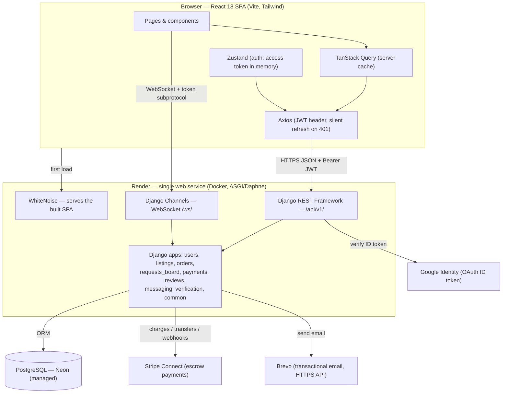
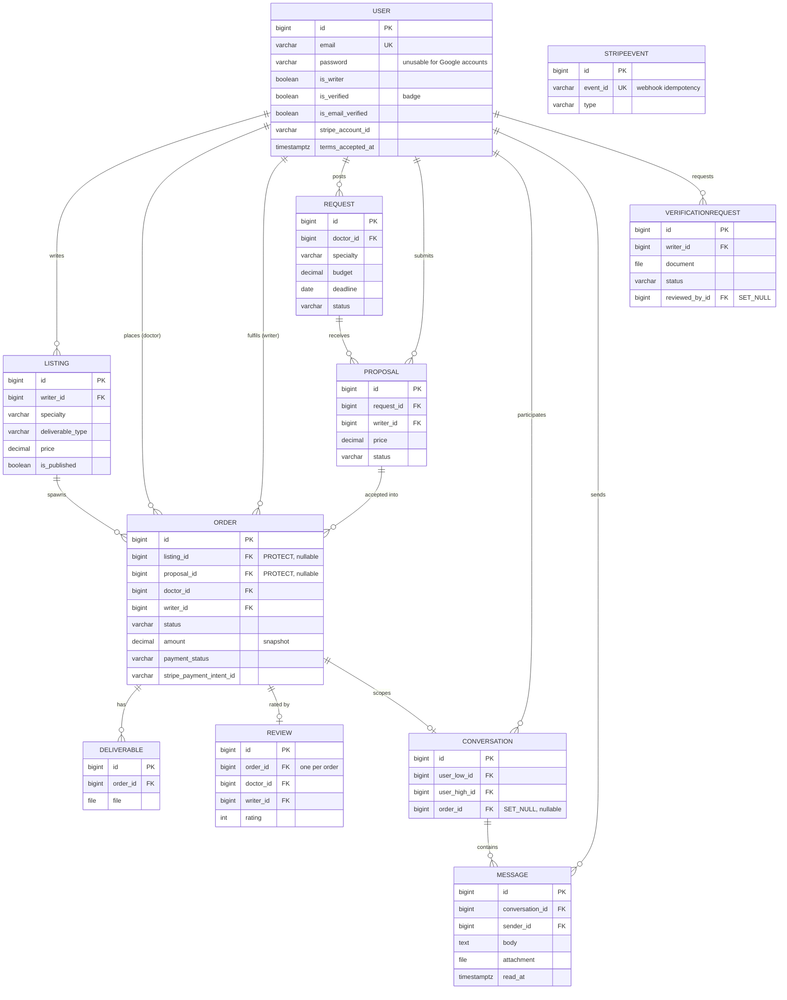

# Kessia — Technical Manual Review (MR) Preparation

> Preparation sheet for the oral technical review. The application, code and
> repository are ready; this document gathers the **up-to-date** architecture and
> database diagrams (the build went well beyond the Stage-3 scope) and the talking
> points for each evaluation criterion.
>
> Historical spec: [`Technical_Documentation_(Stage_3).md`](<Technical_Documentation_(Stage_3).md>).
> This file documents the system **as built**.

---

## 1. What to have ready on the day

- [x] **Functional application** — deployed to production: <https://kessia-j1mk.onrender.com>
- [x] **Application architecture diagram** — §3 below (+ [`Architecture Diagram.png`](<Architecture Diagram.png>))
- [x] **Database diagram** — §4 below
- [x] **Clean, professional README** — on the code branch, with architecture + DB diagram links
- [x] **GitHub repository** — <https://github.com/victormonnot/Kessia> (well-structured, documented)
- [x] **Tests green** — 161 backend (`pytest`), 22 frontend (`vitest`), linters clean
- [x] **Demo dataset** — `python manage.py seed_demo` (`doctor@kessia.demo` / `writer@kessia.demo`, pwd `demo1234`)
- [x] **Swagger API docs** — <https://kessia-j1mk.onrender.com/api/docs/>

---

## 2. Project status — completion

A **functional MVP with no known blocking bugs**, live in production. It delivers
the full two-sided marketplace plus payments, real-time chat, reviews, a verified
badge, the complete account lifecycle, and Google sign-in. Scope **exceeded** the
Stage-3 MVP (5 models → 10 models across 8 apps).

---

## 3. System architecture (as built)

Three-tier app: a React SPA, a Django REST + Channels (ASGI) API, and PostgreSQL —
plus three external services. In production a **single Render web service** serves
both the built SPA (via WhiteNoise) and the API on one origin.

**Request flow (REST):** Axios attaches the in-memory access token → DRF
authenticates (SimpleJWT) and checks permissions → the ORM reads/writes
PostgreSQL → DRF serialises JSON. On a `401`, Axios silently calls
`/auth/refresh/` using the httpOnly refresh cookie, then retries.

**Real-time flow:** the browser opens a WebSocket carrying the access token in the
connection subprotocol; a Channels consumer authenticates it and joins the
conversation group; messages POSTed over REST are broadcast to the group.

---

## 4. Database diagram (as built)

10 models across 8 apps.

**Key relational decisions to be ready to explain**
- **Order is the hub.** It can originate from a *listing* purchase **or** an accepted
  *proposal* (both nullable FKs). `amount` and `writer` are **snapshotted** at
  creation so the engagement never depends on a later-edited listing/proposal.
- **`on_delete` is deliberate.** `order.listing`/`order.proposal` use **PROTECT**
  (can't delete a listing/proposal with orders); party FKs use CASCADE.
- **One review per order**, gated to *completed* orders — reviews can't be faked.
- **Canonical conversation pairs** (`user_low_id < user_high_id`) + partial-unique
  constraints dedupe threads regardless of who starts them.
- **`StripeEvent`** stores processed webhook IDs for **idempotency** (no double-pay).
- **Indexes** on filtered columns (`specialty`, `status`, …) back the catalogue.

---

## 5. Technology choices (be ready to justify)

| Choice | Reasoning |
|--------|-----------|
| **Django + DRF** | Batteries-included: ORM, admin, auth, serializers, permissions, filtering, pagination. (Pivoted from FastAPI in Sprint 0 — decided before any feature code.) |
| **SimpleJWT + httpOnly cookie** | Short-lived access token (15 min) in memory + rotating refresh token in an httpOnly cookie = XSS-resistant; CSRF double-submit guards the cookie endpoints. |
| **PostgreSQL (Neon in prod)** | Relational integrity for a marketplace; real locking for atomic proposal acceptance; Neon's free tier is durable (Render's free Postgres expires). |
| **Django Channels (ASGI/Daphne)** | Real-time chat without polling. |
| **React + Vite + Tailwind** | Fast component-driven UI for role-conditional views; Vite for speed + built-in Vitest. |
| **TanStack Query + Zustand** | Declarative server-cache + minimal auth store. |
| **Brevo (HTTPS API)** | Transactional email that works where the host blocks SMTP (Render). |
| **Stripe Connect** | Marketplace escrow: hold funds, release on completion, auto-refund. |
| **Google Identity (OIDC)** | Password-less sign-in; we verify the signed ID token server-side. |
| **Docker + Render** | One-command local stack; single-origin production deploy. |

---

## 6. Talking points by evaluation criterion

**How does the application work?** → §3 (request, real-time, and refresh flows).
Walk the demo: browse → order/propose → pay (escrow) → chat → deliver → complete
(release) → review → badge.

**How did you test it?** → [`QA/QA_and_Testing.md`](QA/QA_and_Testing.md): 161
backend + 22 frontend tests, on real PostgreSQL, with Stripe/Google **mocked**;
plus a manual end-to-end script and live production QA. Show a `pytest -q` run and
the Swagger docs.

**Team collaboration** → PO (Soumia) sets/accepts scope across bi-weekly meetings
([`Meetings/`](Meetings)); Backend Lead (Yasi) + Frontend Lead (Victor) split by
an agreed API contract; shared QA. See [`Sprints/`](Sprints).

**Git & GitHub best practices** → feature/fix branches → PR review → `dev` → `main`;
Conventional Commits; documentation isolated on `technical_doc`; tests as a merge gate.

**Technical concepts to be able to explain**
- **Authentication:** JWT (access in memory, refresh in httpOnly cookie), silent
  refresh on 401, secure logout via token blacklist, CSRF double-submit, WebSocket
  auth via subprotocol token, **Google OAuth** ID-token verification.
- **Password hashing:** Django's PBKDF2 hasher; Google accounts get an *unusable*
  password (`set_unusable_password`).
- **RBAC / access control:** role flag (`is_writer`) + ownership permissions
  (`IsListingOwner`, `IsOrderParticipant`) + **email-verification gating**
  (`IsEmailVerified` — unverified = read-only) + admin via Django admin.
- **Security:** escrowed payments, idempotent webhooks, access-gated file downloads,
  upload size/type limits, **rate-limiting** (login/register/email senders), CORS +
  CSRF + secure cookies, COOP for OAuth popups, non-enumerating password reset.
- **DB relations:** the `Order`-centric model, snapshots, `on_delete` policy, the
  one-review-per-order constraint, canonical conversation pairs.
- **Frontend design:** SPA + client routing, TanStack Query cache + silent refresh,
  Zustand auth, optimistic/guarded UI states, route guards (`ProtectedRoute`,
  `WriterRoute`, `GuestRoute`, `VerifiedRoute`).

**Demo data / environment** → `seed_demo` for a populated demo;
production at <https://kessia-j1mk.onrender.com>.
